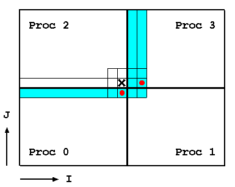

<!-- BEGIN COMMENT -->

[<< 附录C](CMAQ_UG_appendixC_spatial_data.md) - [返回](../README.md) - [附录E >>](CMAQ_UG_appendixE_configuring_WRF.md)

<!-- END COMMENT -->


# 附录D CMAQ的并行运算

## D.1 数据的常规结构

有几种使应用程序并行化的方法，例如数据并行性。数据并行是一种将数据分解为多个“相等”的部分并在处理器之间分配数据的方法。每个处理器都在其分配的部分上工作。CMAQ基于此方法实现并行运行。

CMAQ模型在4D空间（ncols、nrows、nlays、nspcs）上运行，但仅对空间区域的数据进行了分解（即仅分解nclos和nrows，不分解nlays和nspcs）。当使用NPROCS个处理器运行CMAQ时，会将NPCOL个处理器分配给列维度，将NPROCS/NPCOL个处理器分配给行维度（NPROCS=NPCOL×NPROW）。如果模拟区域上列的数量不能被NPCOL整除，则去除第一部分外的其余部分将平均分配给剩下的处理器。相同的方法也将应用于行维度。例如图D-1所示，给定一个100×75（列×行）的数据网格和6个处理器，沿着列维度有三个处理器，沿着行维度有两个处理器，以下子域大小（NCOLS×NROWS）将分配给每个处理器：34×38（处理器0），33×38（处理器1和2），34×37（处理器3）和33×37（处理器4和5）。


**图D-1. 区域分解图**

## D.2 处理器间通信

在某些诸如平流的科学过程中，当模型在分布式存储系统上运行时，处理器需要来自相邻处理器的数据（处理器间通信）。因此开发了一个处理器间通信库STENEX，以提供一个简单而强大的接口来处理各种相邻处理器的通信。相邻定义为在八个主要地理方向上与给定处理器（蓝色块）相邻的处理器：N、NE、E、SE、S、SW、W和NW（图D-2）。


**图D-2. 相邻处理器的描述**

为了说明处理器之间的数据访问（图D-3），假定我们将4个处理器进行了2×2的区域分解，下面的代码在处理器2上执行。显然，在用“X”表示的网格单元上进行的计算需要用红点表示的数据，该数据位于相邻的处理器0和3中。
```
 DIMENSION DATA( NCOLS, NROWS )

 DO J = 1, NROWS
   DO I = 1, NCOLS
       DATA(I,J) = A(I+2,J) * A(I, J-1)
    END DO
 END DO
```


**图D-3. 处理器间所需数据通讯的一个示例**

为了促进如上图示例中所示的处理器间通信，模型使用了“重影”区域（数据结构中的额外空间），即维度数据（NCOLS+2，NROWS+1）。重影区域的厚度取决于算法所需的重叠量。

模具交换（Stencil Exchange，SE）库是在Fortran 90中设计的，它使用基于对象的基础技术来处理各种类型的通信，以隐藏对低级数据移动的管理。SE解决了四种通信类型，下面提供了每种类型的简要说明。

* 内部为重影区域，在图D-4中以浅蓝色表示。这种特定类型的通信正在HADV和HDIFF等各种地方使用。


**图D-4. 使用内部“重影”区域的方式进行通信**

* 小节数据重新分配（图D-5）。在过程分析中使用了这种特定类型的通信。


**图D-5. 使用小节数据重新分配的方式进行通讯**


## D.3 并行I/O

CMAQ中的所有I/O操作均由I/O API库处理。而I/O API库是为串行代码设计的。因此，CMAQ无法在任何并行计算平台中直接利用I/O API库中包含的任何I/O功能（例如READ3和WRITE3）。

CMAQv4.7.1和更高版本中包含一个名为“PARIO”的目录，该目录旨在弥补这一问题。PARIO包含一组较小的函数，这些函数与I/O API中的函数相对应等效，但可以并行运行。以下I/O API例程具有PARIO等效项：READ3、INTERP3、WRITE3、CHECK3、OPEN3、CLOSE3、DESC3、M3ERR、M3EXIT、M3WARN。PARIO库中的每个文件名都有一个“P”前缀，以区别于I/O API库中的对应文件名，例如POPEN3和PINTERP3。PARIO子例程的替换是在编译时通过CPP标志完成的。请注意，任何PARIO例程中的子例程参数列表都与I/O API对应例程中的子例程参数列表相同。

在输出端，要求所有处理器将其处理的部分数据发送到处理器0，处理器0将把每个子部分合并在一起，然后将其输出到文件中（图D-8）。这被认为是“伪”并行I/O方法，并且该方法正在PARIO中使用。


**图D-8. 将来自每个处理器的所有子区域数据合并到I/O处理器中**

在CMAQv5.2和更高版本中，我们已经开发了一种真正的并行I/O方法，称为PIO（Wong等人）。PIO允许每个处理器同时将其部分写入输出文件（图D-9）。


**图D-9. 真正的并行I/O方法**

要调用此功能，用户必须在构建了传统上不用于CMAQ的其他库之后，重新构建CMAQ，并保留传统库，除了在[第3章](../CMAQ_UG_ch03_preparing_compute_environment.md)中下载的非“mpi” IOAPI库。调用此选项所需的其他库包括PnetCDF库和IOAPI库的“mpi”版本。它还需要安装并行文件系统，例如具有足够I/O硬件（例如磁盘驱动器）和I/O子系统的Lustre或BeeGFS，以支持并行文件系统软件。

**PnetCDF库**

PnetCDF库可补充经典netCDF库以实现并行I/O。可从 https://parallel-netcdf.github.io/ 下载PnetCDF库，用户应查找并遵循网站上给出的正确安装说明。用户应使用MPI Fortran 90和C编译器安装独立的PnetCDF库。成功安装后，请设置环境变量PATH和LD_LIBRARY_PATH，以确保该变量的路径中包括PnetCDF库和bin的目录。请注意，如果未设置，则用户可能必须手动设置这些路径，并且每次启动新的Shell时必须加载这些路径。注意：用户此时不应重建其netCDF库，在CMAQ中，经典netCDF库和PnetCDF库可以作为两个独立的库进行交互。

**IOAPI库**

I/O API库在netCDF库和CMAQ之间提供接口，以处理整个CMAQ代码中的输入和输出（I/O）调用。可以从 https://www.cmascenter.org/download/software/ioapi/ioapi_3-2.cfm?DB=TRUE 下载I/O API库的最新版本（**支持版本: IOAPI 3.2 tagged 20200828**）。

下面是在Linux系统（带有C-shell和GNU编译器）上安装IOAPI库的一般步骤。这些说明只是示例，建议您在安装CMAQ时使用可用的最新版本。

这种方法还需要安装“mpi” I/O API库，如下所示（请注意，在完成第3章第3.2.3节中的步骤之后，应遵循以下步骤）：

```
setenv BIN Linux2_x86_64gfortmpi
```

编辑ioapi文件夹中的Makeinclude.Linux2_x86_64gfortmpi文件，注释掉所有openMP选项，因为CMAQ不支持openMP。注意：如果用户使用的是ifort编译器，则还需要删除ioapi/Makeinclude.Linux2_x86_64ifortmpi文件中的-Bstatic标志。

```
OMPFLAGS = # -fopenmp 
OMPLIBS = # -fopenmp
```

在顶级IOAPI_3.2目录中运行：
```
make configure
make
```

构建所需的库之后，用户必须构建CCTM。在编译CCTM之前，用户必须通过在模型构建步骤中取消注释bldit_cctm.csh中的以下行并与I/O API 3.2链接来打开此功能。

```
#set MakefileOnly       #>取消注释以构建Makefile文件而非直接编译
#set build_parallel_io  #>取消注释以采用并行I/O（pnetcdf）来构建
```

在构建了BLD目录（Makefile所在的目录）之后，请转到该目录并编辑Makefile以包含PNETCDF和正确的I/O API BIN，然后再编译代码。这些编辑的示例如下所示：

```
LIB = /home/CMAQ_PIO/CMAQ_libs
include_path = -I /home/CMAQ_PIO/CMAQ_libs/ioapi_3.2/Linux2_x86_64ifortmpi \
               -I /home/CMAQ_PIO/CMAQ_libs/ioapi_3.2/ioapi/fixed_src \
               -I $(LIB)/mpi/include -I.

IOAPI  = -L/home/CMAQ_PIO/CMAQ_libs/ioapi_3.2/Linux2_x86_64ifortmpi -lioapi
NETCDF = -L$(LIB)/netcdf/lib -lnetcdf -lnetcdff
PNETCDF = -L$(LIB)/pnetcdf/lib -lpnetcdf
LIBRARIES = $(IOAPI) $(NETCDF) $(PNETCDF)
```
 
最后，用户还必须编辑CCTM运行脚本，在输出文件路径的前面插入“MPI：”，如下所示：
```
  setenv CTM_CONC_1      "MPI:\$OUTDIR/CCTM_CONC_\${CTM_APPL}.nc -v"       #> On-Hour Concentrations
```
有关安装PIO的进一步指导，或者在使用PIO功能时遇到困难，请通过wong.david-c@epa.gov与David Wong联系。

## D.4 参考文献:

Wong, D.C., Yang, C.E., Fu, J.S., Wong, K., & Gao, Y. (2015). An approach to enhance pnetCDF performance in environmental modeling applications. Geosci. Model Dev., 8, 1033-1046.

<!-- BEGIN COMMENT -->

[<< 附录C](CMAQ_UG_appendixC_spatial_data.md) - [返回](../README.md) - [附录E >>](CMAQ_UG_appendixE_configuring_WRF.md) <br>
CMAQ用户指南 (c) 2020<br>
<!-- END COMMENT -->
