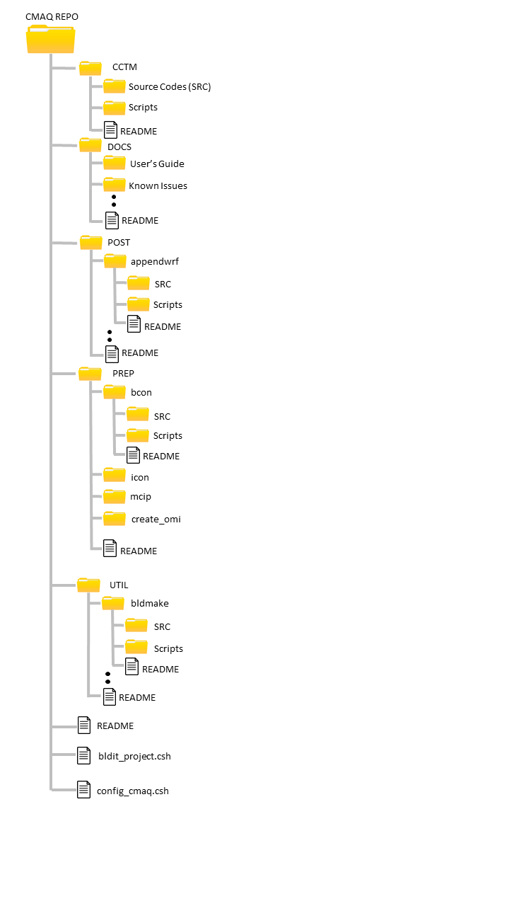

<!-- BEGIN COMMENT -->

[<< 前一章](CMAQ_UG_ch04_model_inputs.md) - [返回](README.md) - [下一章 >>](CMAQ_UG_ch06_model_configuration_options.md)

<!-- END COMMENT -->

# 5. 运行CMAQ

## 5.1 简介

在本章中，用户将学习如何获取CMAQ源代码以及如何设置CMAQ环境以完成CMAQ运行。应该注意的是，在配置CMAQ环境之前，请参阅第三章[准备计算环境]( CMAQ_UG_ch03_preparing_compute_environment.md )，以了解对您系统上硬件和软件的最低要求。

## 5.2 获取CMAQ源代码

可以使用git或从GitHub托管的git存储库下载压缩包来安装CMAQ源代码。此处介绍了这两种方式。

### 5.2.1 Git安装

在您要安装CMAQ的目录中，发出以下命令来克隆CMAQv5.3的官方EPA GitHub存储库：

`git clone -b master https://github.com/USEPA/CMAQ CMAQ_REPO`

使用git克隆选项，CMAQ将安装到以下目录：

```
CMAQ_REPO/CCTM
CMAQ_REPO/PREP
CMAQ_REPO/POST
CMAQ_REPO/UTIL
CMAQ_REPO/DOCS
```

### 5.2.2 Zip文件安装

可从公共GitHub存储库中获取CMAQ源代码的Zip文件。从 https://github.com/USEPA/CMAQ 单击“Clone or download”按钮，然后选择“Download ZIP”以下载CMAQv5.3存储库的Zip文件。或者，您可以从[EPA CMAQ网站]( https://www.epa.gov/cmaq/access-cmaq-source-code )下载Zip文件。

可从CMAS中心获得用于测试软件安装的参考输入/输出数据。*注意该数据无法通过GitHub获得*。您必须注册/登录才能从CMAS中心访问源代码和数据。

在您要安装CMAQ的目录中，解压缩模型压缩文件：

`unzip CMAQ-master.zip`

将创建以下目录：

```
CMAQ-master/CCTM
CMAQ-master/PREP
CMAQ-master/POST
CMAQ-master/UTIL
CMAQ-master/DOCS
```

Git和Zip文件安装选项将在Linux系统上产生稍微不同的子目录。使用git clone命令的安装目录是`CMAQ_REPO`，使用Zip文件的安装目录是`CMAQ-master`。本指南中的后续说明将基于git clone安装。对于Zip文件安装，请在随后的说明中将`CMAQ_REPO`替换为`CMAQ-master`。目录名称的差异突出显示了这两个选项之间的功能差异。克隆存储库使用户可以访问完整的存储库及其历史记录，而下载Zip文件将仅允许访问5.3版本。

## 5.3 CMAQ存储库结构

下载源代码后，用户可以浏览存储库以熟悉结构。存储库的摘要图像如下所示：

<a id=Figure5-1></a>



**图5-1 CMAQ存储库结构**

在上图中，可以看出CMAQ存储库中有五个主要子文件夹。第一个文件夹CCTM包含驱动CMAQ化学传输模型（CCTM，CMAQ Chemistry Transport Model）的所有源代码（即fortran/C程序）和脚本。

第二个文件夹DOCS包含与CMAQ程序套件有关的所有相关文档，包括用户指南、发行说明、与当前发行版本相关的已知问题、以及开发人员指南（用于全面描述CMAQ的开源协作工作流程，和有关如何通过GitHub贡献代码的操作步骤）。

存储库中的第三个文件夹是POST文件夹，其中包含几个非常有用的工具，用于对输入/输出数据文件进行后处理。文件夹中的每个工具都带有用于运行该工具的源代码、脚本和说明文件。可在[第8章]( CMAQ_UG_ch08_analysis_tools.md )中找到此文件夹中工具的技术说明。

存储库中的第四个文件夹是PREP文件夹，其中包含几个预处理程序，可以在CCTM之前运行这些程序以准备气象、初始条件和边界条件输入。与POST工具类似，在PREP下的每个子文件夹中都提供了有关编译和运行程序的文档。

存储库中的最后一个文件夹是UTIL文件夹，其中包含与CMAQ程序套件有关的实用程序。一个示例是bldmake实用程序，当您使用CMAQ存储库中的任何构建脚本时，该实用程序用于将源代码编译为可执行文件。此存储库中还包括一个README文件，概述了发行版的内容，并提供了两个附加的C-Shell脚本`bldit_project.csh`和`config_cmaq.csh`。`bldit_project.csh`允许用户提取构建和运行脚本并在存储库外部编译模型，而`config_cmaq.csh`则有助于为CMAQ项目实施一致的环境设置。以下各节将讨论这两个脚本。

## 5.4 在存储库外部用户指定的目录中构建CMAQ

克隆存储库或解压缩CMAQ发行版的tar文件时，默认的构建和运行脚本会将顶级目录识别为`CMAQ_HOME`（在CMAQv5.2之前是M3HOME）。对于特定应用程序，此目录是Linux系统上CMAQ安装的任意基本位置。如果用户在该存储库文件夹内构建并运行CMAQ，则无需在`bldit_project.csh`脚本中显式设置`CMAQ_HOME`。而如果用户希望提取构建和运行脚本并在存储库外部编译模型，则需要在`bldit_project.csh`中指定`CMAQ_HOME`。执行`bldit_project.csh`将自动执行此提取操作，并在指定的`CMAQ_HOME`位置下创建一个CMAQ文件夹结构。要执行此操作，请在脚本`bldit_project.csh`中修改变量`CMAQ_HOME`，以标识要在其下安装CMAQ软件包的文件夹。例如：

```
set CMAQ_HOME = /home/username/CMAQ_v5.3
```

现在执行脚本：

```
./bldit_project.csh
```

应该注意的是，从现在开始，其他CMAQ目录都会相对关联到CMAQ_HOME，这也是您的CMAQ项目将在其中运行的地方。尽管此目录结构对于基准测试案例和大多数CMAQ应用程序都很方便，但其他配置也是可以的。

## 5.5 CMAQ环境的初始化

配置变量的一致性对于构建CMAQ本身（而不仅仅是它的库）至关重要。因此，CMAQ包括配置脚本`config_cmaq.csh`，以帮助对CMAQ及其关联的库强制实施一致的环境设置。[附录A]( Appendix/CMAQ_UG_appendixA_model_options.md )列出了为构建过程定义的`config_cmaq.csh`变量，并给出了这些变量的建议值。

请注意，对于多处理器应用程序，建议为Fortran编译器（myFC）指定Fortran MPI wrapper script mpifort（对于Intel编译器及GNU和PGI fortran编译器，请使用mpifort）。使用此脚本，而不是直接调用Fortran编译器，将确保并行构建中包含编译器的完整MPI组件套件（库和包含文件），而不需要用户再提供其他信息。

使用以下步骤初始化CMAQ环境：

```
source config_cmaq.csh [compiler]
```

运行上述命令后，现在应该注意到在CMAQ_HOME下已创建了data目录，用于储存模型的输入和输出数据。还创建了lib目录，包含指向以下文件所需的已编译二进制库文件的链接，用于构建CMAQ可执行文件。CMAQ脚本使用以下环境变量来表示这些目录的位置：


`CMAQ_LIB   = $CMAQ_HOME/lib` (CMAQv5.2之前使用M3LIB)<br>
`CMAQ_DATA  = $CMAQ_HOME/data` (CMAQv5.2之前使用M3DATA)

如果遇到关于找不到库的错误，请检查`config_cmaq.csh`脚本变量IOAPI、NETCDF或MPI的设置，以确保它们正确指向这些库在Linux系统上的位置。

仅在全新安装CMAQ时才需要调用`config_cmaq.csh`脚本，以确保指向这些库的链接正常工作。对于每个连续的会话，当您运行任何构建或运行脚本时，将自动创建到这些库的链接。

## 5.6 编译CMAQ化学运输模型（CCTM，CMAQ Chemistry-Transport Model）

使用上述预处理器生成所有必需的CMAQ输入文件后，用户现在即可以编译CCTM。CMAQ当前的编码结构基于模块化级别，该模块化级别将CCTM的主要驱动程序、科学模块、数据估计模块和控制/实用程序子例程区分开来。科学模块（包括气象、排放、化学-运输模型的子模型）以及分析和可视化子系统也彼此区分。

在CCTM中，影响污染物浓度场的处理模块分类如下。每个项目符号都包含对过程的描述，并在括号中带有模块名称。这些模块将在[第6章]( CMAQ_UG_ch06_configuring_the_model.md )中进一步讨论。

科学模块：

- 水平对流（hdv）
- 垂直对流（VADV）
- 水平扩散（hdiff）
- 垂直扩散（vdiff）
- 排放（emis）
- 在线BEIS3生物源排放（biog）
- 在线烟羽抬升（plrise）
- 气相化学反应求解器（gas）
- 水相反应和云混合（cloud）
- 气溶胶动力学和尺寸分布（aero）
- 平流层/对流层交换的潜在涡度尺度（pv_o3）

用户可以选择每个科学模块处理过程的不同选项，从而以多种方式配置模型。模型配置被分为构建时选项和运行时选项。要在构建期间修改任何科学选项，请编辑`bldit_cctm.csh`脚本。`bldit_cctm.csh`脚本还包含其他信息，例如以单处理器或多处理器模式以及调试模式运行的选项。要修改任何运行时选项，例如打开在线生物源排放计算或使用在线风吹起尘排放，请编辑运行脚本`run_cctm.csh`并设置相应的环境变量。要了解有关特定科学过程的构建和运行时配置的更多信息，请参见下一章[第6章]( CMAQ_UG_ch06_configuring_the_model.md )。要查看完整的配置选项列表，请参考[附录A]( Appendix/CMAQ_UG_appendixA_model_options.md )。

一旦根据用户的需要配置了`bldit_cctm.csh`脚本，用户就可以运行该脚本来构建CCTM可执行文件了。为此，请运行以下命令：

```
cd $CMAQ_HOME/CCTM/scripts
source bldit_cctm.csh [compiler] [version] |& tee build_cctm.log
```

bldit脚本调用CMAQ实用程序[bldmake]( ../../UTIL/bldmake/README.md )，该程序从您的CMAQ Git存储库中提取源代码，根据您选择的选项构建Makefile，并自动编译可执行文件。在使用默认配置正常终止脚本之后，用户将注意到已创建一个BLD目录。这是CCTM可执行文件、以及相关的源代码和构建模型所需的Makefile的位置。如果通过MakeFile对fortran源代码进行了任何更改，则可以在此目录中使用一些命令来更新可执行文件。例如，如果用户想以调试模式重新编译源代码而不是重新运行`bldit_cctm.csh`脚本，则用户可以使用以下命令：

```
cd BLD_CCTM_v53_[compiler][version]
make clean
make DEBUG=TRUE
```

在另一个示例中，如果用户对BLD目录中的源代码进行了任何更改，并且想要更新CCTM可执行文件以反映这些更改，则用户可以使用以下命令：

```
cd BLD_CCTM_v53_[compiler][version]
make
```

Make实用程序足够智能，可以仅编译由Makefile中每个源文件的依赖关系定义的修改文件和所有关联文件。

## 5.7 运行CCTM

编译CCTM可执行文件后，就可以运行模型了。与`bldit_cctm.csh`脚本非常相似，要修改任何运行时选项，请参考[附录A]( Appendix/CMAQ_UG_appendixA_model_options.md )编辑`run_cctm.csh`脚本，以获取可选设置的完整列表。配置这些设置后，使用以下命令运行脚本：


```
cd $CMAQ_HOME/CCTM/scripts
run_cctm.csh |& tee run_cctm.log
```

### 5.7.1 CCTM日志文件

CCTM模拟将生成两种类型的日志文件，即主日志文件（例如run_cctm.log）和具有特定名称约定的处理器特定的日志文件：
```
CTM_LOG_[ProcessorID].v53_[compiler]_[data_name]/_[RUNDATE].log
```

主日志文件中包含了大量的元数据和有关模拟详细信息的有用信息。以下示例描述了其中的一些信息：
```
Start Model Run At  Tue Apr 9 08:18:06 EDT 2019
Compiler is set to intel
No compiler version given. Atmos system Detected. Assume Intel 18.0

Working Directory is ...
Build Directory is ...
Output Directory is ...
Log Directory is ...
Executable Name is CCTM_v53.exe

---CMAQ EXECUTION ID: CMAQ_CCTMv53_[userID]_YYYYMMDD_hhmmss_nanosecs ---

Set up input and output files for Day YYYY-MM-DD.

Existing Logs and Output Files for Day YYYY-MM-DD Will Be Deleted
/bin/rm: No match.

CMAQ Processing of Day 20140620 Began at Tue Apr  9 08:18:07 EDT 2019
```
本部分记录了模拟的文件夹结构、用户名和运行日期，旨在帮助在运行完成后保持模拟结果的透明性。本节后面是CMAQ和I/O API标头，以及所有环境变量及其在本次模拟中取值的记录。

接下来，程序输出一个表，描述运行时对模拟区域的分解。
```
          -=-  MPP Processor-to-Subdomain Map  -=-
                 Number of Processors = 128
    ____________________________________________________
    |                                                  |
    |  PE    #Cols    Col_Range     #Rows    Row_Range |
    |__________________________________________________|
    |                                                  |
    |  0       12      1:  12         24      1:  24   |
    |  1       12     13:  24         24      1:  24   |
    |  2       12     25:  36         24      1:  24   |
    |  3       12     37:  48         24      1:  24   |
    |  4       12     49:  60         24      1:  24   |
    |  5       12     61:  72         24      1:  24   |
    |  6       12     73:  84         24      1:  24   |
    |  7       12     85:  96         24      1:  24   |
    |  8       12     97: 108         24      1:  24   |
    |  9       12    109: 120         24      1:  24   |
    | 10       12    121: 132         24      1:  24   |
    | 11       11    133: 143         24      1:  24   |
    | 12       11    144: 154         24      1:  24   |
    | 13       11    155: 165         24      1:  24   |
    | 14       11    166: 176         24      1:  24   |
    | 15       11    177: 187         24      1:  24   |
    | 16       12      1:  12         24     25:  48   |
    | 17       12     13:  24         24     25:  48   |
    | 18       12     25:  36         24     25:  48   |
    | 19       12     37:  48         24     25:  48   |
    | 20       12     49:  60         24     25:  48   |
    | 21       12     61:  72         24     25:  48   |
    | 22       12     73:  84         24     25:  48   |
    | 23       12     85:  96         24     25:  48   |
    | 24       12     97: 108         24     25:  48   |
    | 25       12    109: 120         24     25:  48   |
    | 26       12    121: 132         24     25:  48   |
    | 27       11    133: 143         24     25:  48   |
    | 28       11    144: 154         24     25:  48   |
    | 29       11    155: 165         24     25:  48   |
    | 30       11    166: 176         24     25:  48   |
    | 31       11    177: 187         24     25:  48   |
    | 32       12      1:  12         24     49:  72   |
    | 33       12     13:  24         24     49:  72   |
    | 34       12     25:  36         24     49:  72   |
    | 35       12     37:  48         24     49:  72   |
    | 36       12     49:  60         24     49:  72   |
    | 37       12     61:  72         24     49:  72   |
    | 38       12     73:  84         24     49:  72   |
    | 39       12     85:  96         24     49:  72   |
    | 40       12     97: 108         24     49:  72   |
    | 41       12    109: 120         24     49:  72   |
    | 42       12    121: 132         24     49:  72   |
    | 43       11    133: 143         24     49:  72   |
    | 44       11    144: 154         24     49:  72   |
    | 45       11    155: 165         24     49:  72   |
    | 46       11    166: 176         24     49:  72   |
    | 47       11    177: 187         24     49:  72   |
    | 48       12      1:  12         23     73:  95   |
    | 49       12     13:  24         23     73:  95   |
    | 50       12     25:  36         23     73:  95   |
    | 51       12     37:  48         23     73:  95   |
    | 52       12     49:  60         23     73:  95   |
    | 53       12     61:  72         23     73:  95   |
    | 54       12     73:  84         23     73:  95   |
    | 55       12     85:  96         23     73:  95   |
    | 56       12     97: 108         23     73:  95   |
    | 57       12    109: 120         23     73:  95   |
    | 58       12    121: 132         23     73:  95   |
    | 59       11    133: 143         23     73:  95   |
    | 60       11    144: 154         23     73:  95   |
    | 61       11    155: 165         23     73:  95   |
    | 62       11    166: 176         23     73:  95   |
    | 63       11    177: 187         23     73:  95   |
    | 64       12      1:  12         23     96: 118   |
    | 65       12     13:  24         23     96: 118   |
    | 66       12     25:  36         23     96: 118   |
    | 67       12     37:  48         23     96: 118   |
    | 68       12     49:  60         23     96: 118   |
    | 69       12     61:  72         23     96: 118   |
    | 70       12     73:  84         23     96: 118   |
    | 71       12     85:  96         23     96: 118   |
    | 72       12     97: 108         23     96: 118   |
    | 73       12    109: 120         23     96: 118   |
    | 74       12    121: 132         23     96: 118   |
    | 75       11    133: 143         23     96: 118   |
    | 76       11    144: 154         23     96: 118   |
    | 77       11    155: 165         23     96: 118   |
    | 78       11    166: 176         23     96: 118   |
    | 79       11    177: 187         23     96: 118   |
    | 80       12      1:  12         23    119: 141   |
    | 81       12     13:  24         23    119: 141   |
    | 82       12     25:  36         23    119: 141   |
    | 83       12     37:  48         23    119: 141   |
    | 84       12     49:  60         23    119: 141   |
    | 85       12     61:  72         23    119: 141   |
    | 86       12     73:  84         23    119: 141   |
    | 87       12     85:  96         23    119: 141   |
    | 88       12     97: 108         23    119: 141   |
    | 89       12    109: 120         23    119: 141   |
    | 90       12    121: 132         23    119: 141   |
    | 91       11    133: 143         23    119: 141   |
    | 92       11    144: 154         23    119: 141   |
    | 93       11    155: 165         23    119: 141   |
    | 94       11    166: 176         23    119: 141   |
    | 95       11    177: 187         23    119: 141   |
    | 96       12      1:  12         23    142: 164   |
    | 97       12     13:  24         23    142: 164   |
    | 98       12     25:  36         23    142: 164   |
    | 99       12     37:  48         23    142: 164   |
    |100       12     49:  60         23    142: 164   |
    |101       12     61:  72         23    142: 164   |
    |102       12     73:  84         23    142: 164   |
    |103       12     85:  96         23    142: 164   |
    |104       12     97: 108         23    142: 164   |
    |105       12    109: 120         23    142: 164   |
    |106       12    121: 132         23    142: 164   |
    |107       11    133: 143         23    142: 164   |
    |108       11    144: 154         23    142: 164   |
    |109       11    155: 165         23    142: 164   |
    |110       11    166: 176         23    142: 164   |
    |111       11    177: 187         23    142: 164   |
    |112       12      1:  12         23    165: 187   |
    |113       12     13:  24         23    165: 187   |
    |114       12     25:  36         23    165: 187   |
    |115       12     37:  48         23    165: 187   |
    |116       12     49:  60         23    165: 187   |
    |117       12     61:  72         23    165: 187   |
    |118       12     73:  84         23    165: 187   |
    |119       12     85:  96         23    165: 187   |
    |120       12     97: 108         23    165: 187   |
    |121       12    109: 120         23    165: 187   |
    |122       12    121: 132         23    165: 187   |
    |123       11    133: 143         23    165: 187   |
    |124       11    144: 154         23    165: 187   |
    |125       11    155: 165         23    165: 187   |
    |126       11    166: 176         23    165: 187   |
    |127       11    177: 187         23    165: 187   |
    |__________________________________________________|
```
使用此输出，用户将能够跟踪在特定处理器上发生的问题到模型区域的地理区域。

然后，随着模型的时间相关部分开始，将以以下形式为每个时间步长提供输出：
```
     Processing Day/Time [YYYYDDD:HHMMSS]: 2015274:000000
       Which is Equivalent to (UTC): 0:00:00  Thursday,  Oct. 1, 2015
       Time-Step Length (HHMMSS): 000500
                 VDIFF completed...    6.2 seconds
                COUPLE completed...    0.0 seconds
                  HADV completed...    0.3 seconds
                  ZADV completed...    0.0 seconds
                 HDIFF completed...    0.1 seconds
              DECOUPLE completed...    0.0 seconds
                  PHOT completed...    0.6 seconds
               CLDPROC completed...    0.0 seconds
                  CHEM completed...    0.4 seconds
                  AERO completed...    0.4 seconds
            Master Time Step
            Processing completed...    8.0 seconds
```
本节记录了模型当前正在处理的日期和时间，以及计算每个主要子流程所花费的时间。在每个模拟小时的末尾，还会计算输出总花费时间。
```
    Processing Day/Time [YYYYDDD:HHMMSS]: 2015274:005500
       Which is Equivalent to (UTC): 0:55:00  Thursday,  Oct. 1, 2015
       Time-Step Length (HHMMSS): 000500
                 VDIFF completed...    0.9 seconds
                COUPLE completed...    0.0 seconds
                  HADV completed...    0.2 seconds
                  ZADV completed...    0.0 seconds
                 HDIFF completed...    0.0 seconds
              DECOUPLE completed...    0.0 seconds
                  PHOT completed...    0.2 seconds
               CLDPROC completed...    0.3 seconds
                  CHEM completed...    0.4 seconds
                  AERO completed...    1.0 seconds
            Master Time Step
            Processing completed...    3.0 seconds
 
      =--> Data Output completed...    0.3 seconds
```
在输出日的每个小时重复此过程，直到该日结束。
```
     ==============================================
     |>---   PROGRAM COMPLETED SUCCESSFULLY   ---<|
     ==============================================
     Date and time 0:00:00   Oct. 2, 2015   (2015275:000000)
 
     The elapsed time for this simulation was     733.0 seconds.
 
real 734.70
user 0.07
sys 0.17

CMAQ Processing of Day 20151001 Finished at Fri Apr  5 11:21:20 EDT 2019

\\\\\=====\\\\\=====\\\\\=====\\\\\=====/////=====/////=====/////=====/////
```

最后一天结束后，将打印每个执行日的计算时间的摘要信息。
```
==================================
  ***** CMAQ TIMING REPORT *****
==================================
Start Day: 2015-10-01
End Day:   2015-10-14
Number of Simulation Days: 14
Domain Name:               WRF_CMAQ_2WAY
Number of Grid Cells:      1538636  (ROW x COL x LAY)
Number of Layers:          44
Number of Processes:       128
   All times are in seconds.

Num  Day        Wall Time
01   2015-10-01   727.67
02   2015-10-02   717.89
03   2015-10-03   709.40
04   2015-10-04   701.84
05   2015-10-05   703.34
06   2015-10-06   708.96
07   2015-10-07   708.07
08   2015-10-08   707.25
09   2015-10-09   706.42
10   2015-10-10   703.56
11   2015-10-11   707.74
12   2015-10-12   705.44
13   2015-10-13   712.43
14   2015-10-14   718.59
     Total Time = 9938.60
      Avg. Time = 709.90 
``` 

特定于处理器的日志文件提供了从映射变量到打开和读取输入文件的数百种模型任务的操作的详细信息。对用户而言可能很重要的警告信息也会打印到这些文件中。要确认模型已完成运行，请查看run.[data].log文件。对于MPI（多处理器）运行，您可以检查任何CTM_LOG_[ProcessorID]* .log文件。成功运行后将在日志底部包含以下行：

```
>>----> Program completed successfully <----<<
```

注意：每个处理器的日志文件也会从$CMAQ_HOME/CCTM/scripts目录移动到数据输出目录：

```
$CMAQ_DATA/output_CCTM_v53_[compiler]/[data_name]
```

### 5.7.2 CCTM输出文件

输出结果将放置在以下目录中：

```
$CMAQ_DATA/output_CCTM_v53_[compiler]_[data_name]
```

并可以包含以下netCDF类型的文件：ACONC, APMDIAG, B3GTS_S, CGRID, CONC, DEPV, DRYDEP, DUSTEMIS, LTNGDIAG1, LTNGDIAG2, MEDIA_CONC, PMDIAG, PT3D_DIAG, RJ_1, RJ_2, RJ_3, SOILOUT, SSEMIS, VDIFF, VSED, WETDEP1, WETDEP2和VEXT_1。有关这些文件中每个文件的深入描述，请参见[第7章]( CMAQ_UG_ch07_model_outputs.md )。


### 5.7.3 导致CCTM模拟崩溃的常见错误

CCTM模拟中的常见错误包括以下内容：

- 输入文件的路径不正确。可在CCTM屏幕输出（捕获在日志文件中）中查找有关找不到输入文件的错误消息。
- 错误的MPI处理。在日志文件末尾的一系列MPI错误通常表明MPI工作未正确提交。

检查CCTM输出日志的最后几行是否有消息，可以帮助诊断为什么模拟未能完成。


<!-- BEGIN COMMENT -->

[<< 前一章](CMAQ_UG_ch04_model_inputs.md) - [返回](README.md) - [下一章 >>](CMAQ_UG_ch06_model_configuration_options.md)<br>
CMAQ用户指南 (c) 2020<br>

<!-- END COMMENT -->
