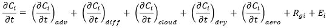

<!-- BEGIN COMMENT -->

[<< 前一章](CMAQ_UG_ch05_running_a_simulation.md) - [返回](README.md) - [下一章 >>](CMAQ_UG_ch07_model_outputs.md)

<!-- END COMMENT -->

# 6 模型配置选项

<a id=Return_to_Top></a>

<!-- BEGIN COMMENT -->

## 目录:

* [6.1 简介](#6.1_Introduction)
* [6.2 数值方法](#6.2_Numerical_Approach)
* [6.3 网格配置](#6.3_Grid_Config)
	* [6.3.1 水平区域和横向边界](#6.3.1_Horizontal_Domains)
	* [6.3.2 垂直区域](#6.3.2_Vertical_Domains)
* [6.4 科学选项](#6.4_Science_Config)
* [6.5 水平对流](#6.5_Advection)
* [6.6 水平扩散](#6.6_Horizontal_Diff)
* [6.7 垂直扩散](#6.7_Vertical_Diff)
* [6.8 干沉降/空气-地面交换](#6.8_Dry_Dep/Air)
	* [6.8.1 干沉降 - m3dry](#6.8.1_Dry_Depm3dry)
	* [6.8.2 干沉降 - STAGE](#6.8.2_Dry_STAGE)
* [6.9 排放源](#6.9_Emissions)
	* [6.9.1 排放源](#6.9.1_Emission_Streams)
	* [6.9.2 实时排放源](#6.9.2_Online_Emission)
	* [6.9.3 排放兼容性](#6.9.3_Emission_Compatability)
* [6.10 气相化学](#6.10_Gas_Phase_Chem)
	* [6.10.1 气相化学机理](#6.10.1_Gas_Phase_Mech)
	* [6.10.2 求解器](#6.10.2_Solver)
	* [6.10.3 光解作用](#6.10.3_Photolysis)
	* [6.10.4 亚硝酸盐(HONO)](#6.10.4_HONO)
* [6.11 气溶胶动力学与化学](#6.11_Aerosol_Dynamics)
* [6.12 水相化学、清除和湿沉降](#6.12_Aqueous_Chemistry)
* [6.13 潜在涡度尺度](#6.13_Potential_Vort)
* [6.14 参考文献](#6.14_References)

<!-- END COMMENT -->

<a id=6.1_Introduction></a>

## 6.1 简介

<!-- BEGIN COMMENT -->

[返回顶部](#Return_to_Top)

<!-- END COMMENT -->

正如在[第1章](CMAQ_UG_ch01_overview.md)中所讨论的那样，CMAQ是一种多污染物、多尺度的空气质量模型系统，可估算臭氧、PM、有毒空气污染物、酸性和营养性污染物的迁移和化学转化，以及能见度的下降和污染物沉降量。CMAQ包括最新的技术和计算方法，可以模拟从城市到全球尺度的空气质量。它可以使用专为快速高效计算而设计的系统架构，对影响空气污染物转化、传输和沉降的复杂大气过程进行建模。（有关如何在CMAQ系统中应用并行计算以提高计算效率的介绍，请参见[附录D](Appendix/CMAQ_UG_appendixD_parallel_implementation.md)。本章将简要概述欧拉空气质量模型的概念公式和CMAQ化学运输模型（CCTM）中各个组件的科学参数。

<a id=6.2_Numerical_Approach></a>

## 6.2 数值方法

<!-- BEGIN COMMENT -->

[返回顶部](#Return_to_Top)

<!-- END COMMENT -->

CMAQ模型的理论基础是大气中的追踪物质在排放、运输、化学和清除过程中的质量守恒。化学物种方程的一般形式源自这种质量守恒，因此大气中物种的浓度C<sub>i</sub>的变化可以用数学表示为：

  

其中等式右侧的项表示由于对流、扩散、云过程（包括混合、清除和水相化学）、干沉降、和气溶胶过程（相分配和气溶胶动力学）引起的C<sub>i</sub>的变化率。R<sub>gi</sub>代表由于气体和异质化学反应而引起的变化率，E<sub>i</sub>是该物种的排放速率。追踪物质的质量守恒和CMAQ中各种粒度分布模式的矩动力方程在广义坐标中进一步制定，其中在相同的公式中允许模型配合常用的水平地图投影（即Lambert正形、极坐标和墨卡托投影）以及不同的垂直坐标（请参见Byun和Ching的第5章和第6章，1999年）。使用时间拆分或过程拆分方法在数值上求解CMAQ的控制方程，其中，每个过程方程是按顺序求解的，通常首先求解最大时间尺度的过程。

<a id=6.3_Grid_Config></a>

## 6.3 网格配置

<!-- BEGIN COMMENT -->

[返回顶部](#Return_to_Top)

<!-- END COMMENT -->

CMAQ是一个三维欧拉空气质量模型。为了求解控制偏微分方程，模型区域（即感兴趣地理区域的大气体积）离散成三维网格单元。模型区域的网格单元和横向边界必须在模型的科学选项（包括化学、排放、气象学和其他外围科学处理器）中严格定义且保持一致性。换句话说，CMAQ系统的所有组件必须使用相同的地图投影和水平网格间距，以保持整个模型区域的科学一致性。东-西维度的网格单元数通常以“列（columns）”或“NCOLS”来计算，而南-北维度的网格单元数通常以“行（rows）”或“NROWS”来计算。垂直方向上通常以“层（layers）”或“NLAYS”来计算。

CMAQ使用广义坐标系将物理空间映射到计算空间；见Byun和Ching（1999）第6章。广义坐标使CMAQ能够在不同的水平投影（如Lambert正形、极坐标和墨卡托投影）和不同的垂直坐标系（如地形跟随"sigma"、高度、混合sigma-压力）下保持质量守恒。CMAQv5.3支持由直线单元组成的建模区域，其中投影空间中每个单元的边长相同（例如&#916;x = &#916;y = 12&nbsp;km）。相比之下，垂直网格通常是不规则的，模型中层的高度在地面附近最薄。水平网格的绝对尺寸（即计算区域的东-西范围和南-北范围）可以不同。

一般来说，CMAQ建模区域的特征（包括地图投影、水平网格间距、垂直网格类型和最大覆盖范围）都是从气象模型继承而来的。从CMAQv5.3和MCIPv5.0开始，CMAQ的公开发布版本仅针对WRF模型的气象数据进行配置。然而，MCIP（为CMAQ转换和准备气象模型数据）可以扩展到处理其他气象模型的数据，作为CCTM的输入气象数据。

<a id=6.3.1_Horizontal_Domains></a>

### 6.3.1 水平区域和横向边界

<!-- BEGIN COMMENT -->

[返回顶部](#Return_to_Top)

<!-- END COMMENT -->

在确定模型区域的水平和垂直范围后，气象模型运行的水平区域必须略大于CMAQ的模拟区域。由于需要更大的气象学区域，因此WRF模拟中的边界条件将不在CMAQ的模拟区域内。由于在WRF横向边界内存在大尺度驱动数据和特定比例尺的物理混合，这些数据不适合在CCTM中使用，因此它们通常在MCIP中被删除。WRF的侧边界通常是WRF模拟区域最外层5个单元的“图框”。这些横向边界用于将大尺度气象驱动数据的影响与WRF模拟相结合。在WRF中会计算横向边界并作为建模区域的一部分。相比之下，CCTM的横向边界是在建模区域之外的。

MCIP可提取WRF建模区域的子集（即一个“窗口”），用于CCTM模拟区域。“窗口”可以是气象模型横向边界内的任何矩形区域，只要它包含名义上足够大的区域覆盖。

CMAQ的水平网格设置包含在网格定义文件（GRIDDESC）中，该文件由MCIP输出，用户可以编辑。有关网格配置的更多详细信息，请参阅PREP/mcip文件夹中的[README.md](../../PREP/mcip/README.md)文件。如果一个组中使用了多个区域，则可以在运行时通过将GRIDDESC和GRID_NAME环境变量分别设置为指向现有网格定义文件和文件中定义的网格之一，来确定CMAQ运行的水平区域。

<a id=6.3.2_Vertical_Domains></a>

### 6.3.2 垂直区域

<!-- BEGIN COMMENT -->

[返回顶部](#Return_to_Top)

<!-- END COMMENT -->

CMAQ可以通过广义坐标支持多个垂直坐标系。保持CMAQ质量守恒的大多数网格转换都是通过数学术语Jacobian实现的；参见Byun和Ching（1999）和Otte和Pleim（2010）的第6章。在CMAQ系统中，用MCIP计算Jacobian矩阵。CCTM中的垂直过程（如行星边界层内的混合和对流混合）也必须投影在一个灵活的坐标系中。

WRF模型中有两种垂直坐标系：地形跟随（“sigma”）坐标系和混合sigma-压力坐标系。在两个垂直坐标系中，都有一个“模型顶部”（通常称为PTOP，或模型顶部的压力）用于限制建模区域的垂直范围。模型顶部通常设置在平流层下层以内（例如50&nbsp;hPa），但对于某些建模应用程序也可以更高。sigma坐标系允许地形的影响随着高度向模型顶部逐渐减小。sigma坐标系（在WRF中技术上称为“eta”）自WRF于20世纪90年代末首次向公众发布以来就一直在使用。混合sigma-压力坐标系在WRFv3.9（2017年发布）中引入，它在大气层下部区域使用地形跟随坐标系，同时向大气层上部过渡到恒定压力坐标系。混合sigma-压力坐标系常被用来减少在陡峭复杂地形中模型中重力波的影响，它可以使模型顶部更高。

从CMAQv5.3和MCIPv5.0开始，sigma坐标系和混合sigma-压力坐标系都受支持。MCIPv5.0被修改为从混合坐标系计算Jacobian，CMAQv5.3有一些更通用的科学过程，以便sigma坐标系和混合坐标系都能得到正确的表示。v5.3之前的CMAQ（以及v5.0之前的MCIP）与WRF 3.9中引入的混合坐标系不兼容。如果在WRF（3.9或更高版本）中使用混合坐标系，则必须使用MCIPv5.0与CMAQv5.3以上版本。有关配置WRF4.0和更高版本以用于CMAQv5.3的说明，请参阅[附录E](Appendix/CMAQ_UG_appendixE_configuring_WRF.md)。

<a id=6.4_Science_Config></a>

## 6.4 科学选项

<!-- BEGIN COMMENT -->

[返回顶部](#Return_to_Top)

<!-- END COMMENT -->

CCTM包含多个用于模拟传输、化学和沉降的科学配置。CCTM中的所有科学配置选项（比如要使用的化学机制）都是在构建（build）可执行文件时设置的。而在可执行文件运行时设置CCTM的模型网格和垂直层结构。选择科学配置选项和模型网格/层配置之间的重要区别在于，更改模型网格/层时不需要重新编译CCTM，但在调用新的科学选项时必须要重新编译CCTM。以下各节介绍如何在`bldit_cctm.csh`和`run_cctm.csh`脚本中进行设置，以利用这些科学选项。在本章的其余部分中，这些文件将被简称为BuildScript和RunScript。

<a id=6.5_Advection></a>

## 6.5 水平对流

<!-- BEGIN COMMENT -->

[返回顶部](#Return_to_Top)

<!-- END COMMENT -->

在CCTM中，平均风（或平流）的三维输送通过连续求解两个水平分量和垂直分量的局部一维方程来表示。CMAQ使用分段抛物线方法（PPM）（Colella和Woodward，1984）来表示三个方向上的示踪平流。该算法基于对流尺度上定义的有限体积子网格。在PPM中，每个网格间隔内的子网格分布用抛物线表示。PPM是一个单调的正定方案。正定方案保持输入值的符号，在这种情况下，这意味着正浓度将保持为正，而不能变为负。

质量守恒是示踪平流的一个关键属性。通过使用WRF/MCIP的动态和热力学一致的气象数据，维持空气质量模拟的数据一致性。然而，在气象模型和CCTM之前使用不同的网格配置（水平或垂直）或由于不同的数值平流方案，可能会出现质量不守恒的情况。虽然可以通过使用相同的网格配置来消除由前者引起的不一致（因此，不建议采用层折叠设置），但由于满足驱动气象模型和CCTM之间的质量连续性方程的数值表示不同，仍可能存在一些质量不守恒的情况。这些质量不守恒表现为一阶项（如果连续性不满足高精度要求，其大小通常可与示踪物的寿命相比较），在三维示踪平流期间可以人为地产生或破坏质量（例如，Mathur和Peters，1990）。

CMAQ有两个选项可以最小化追踪物质平流中的质量守恒误差。在一个方案中（在BuildScript中指定为“local_cons”），首先在CMAQv4.5中实现，然后在CMAQv4.7.1中改进，CMAQ对空气密度进行平流分析，并根据逐层质量连续性方程重新诊断垂直速度场，从而确保CCTM平流密度与从气象模型输入得出的密度相匹配（如Odman和Russell，2000）。简单地说，首先进行x和y平流（每一步的顺序都是相反的，以最小化混叠误差），以产生中间的示踪和密度场。然后，中间密度场用PPM格式进行垂直平流，以便在平流时间步长结束时产生WRF导出的密度场。该方案得到一个估计的垂直速度场，在较低的模型层中相对于WRF导出的场进行最小的调整，但在CMAQ中产生严格的质量守恒的示踪平流。这种方法的一个缺点是，在诊断出的垂直速度场中，错误的“噪声”以非零速度和质量通量的形式积聚在模型的顶部。垂直速度场中的“噪声”导致上层的过度扩散。因此，自CMAQv5.0起推出了一种紧跟wrf中垂直速度计算的方案“wrf_cons”。该方案解决了垂直积分质量连续性方程，使得列积分水平质量散度通过列质量的净变化来平衡（Skamarock等人，2019）。该方案的一个优点是诊断出的垂直速度与WRF垂直速度场的一致性更高，其速度和质量通量均为零。从而消除了上层的速度杂散噪声和过度扩散。该方案的主要缺点是质量守恒得不到保证，因此每个时间步长时必须从气象输入中更新密度。

**“WRF_CONS”**选项是CMAQv5.3的推荐配置。

在3D平流中如需调用"WRF_CONS"选项，应在CCTM的BuildScript中科学模块（Science Modules）部分设置以下内容：

```
set ModAdv = wrf_cons
```
在3D平流中如需调用"LOCAL_CONS"选项，应在CCTM的BuildScript中科学模块（Science Modules）部分设置以下内容：
```
set ModAdv = local_cons
```
***注：local_cons选项是旧版本的设置，使用时可能导致意外结果。***

<a id=6.6_Horizontal_Diff></a>

## 6.6 水平扩散

<!-- BEGIN COMMENT -->

[返回顶部](#Return_to_Top)

<!-- END COMMENT -->

适当湍流测量的缺陷限制了水平湍流扩散的稳健模型参数的发展，其规模和分辨率取决于问题的解决。由于极其精确的最小漫射逆向方案和需要高分辨率建模，需要水平扩散算法来平衡与大气物理水平扩散相关的逆向方案中的数值扩散。目前在CMAQ中，使用EDDY扩散理论对输送污染物的水平扩散流进行参数化。用Smagorinsky的方法（1963年）转换成水平扩散系数，该方法计算局部水平风变形，并将其缩小到水平网格尺寸。

<a id=6.7_Vertical_Diff></a>

## 6.7 垂直扩散

<!-- BEGIN COMMENT -->

[返回顶部](#Return_to_Top)

<!-- END COMMENT -->

CMAQ中的垂直扩散模型是不对称对流模型第2版（“ACM2”）（“PLEIM 2007a.b.”）。ACM2是一种本地和非本地混合封闭PBL方案，它在CMAQ和WRF中得到了实施，用于连续的PBL运输气象和化学。因此，建议在为CMAQ准备气象时也使用WRF或MPAS中的ACM2选项。

BuildScript中的ACM2模型有两个选项，分别与与M3Dry或Stage干沉降选项兼容。

当运行M3Dry干沉降时：

```
Set ModVdiff   = acm2_m3dry
```

运行运行Stage干沉降时：

```
Set ModVdiff   = acm2_stage
```
<a id=6.8_Dry_Dep/Air></a>

## 6.8 干沉降/空气-地面交换

<!-- BEGIN COMMENT -->

[返回顶部](#Return_to_Top)

<!-- END COMMENT -->

大气和地球表面之间的污染物交换可模拟为单向交换（通常称为干沉降），或双向交换，其中通量的方向取决于大气和地表（如土壤、植物气孔）中污染物的相对浓度。如果大气中的浓度大于地表的浓度，则会发生沉降。如果大气中的浓度低于地表的浓度，就会发生排放。CMAQ包含了对这两种情况进行模拟的算法。交换率由地表特征（如植被类型、叶面积指数、地表粗糙度）以及气象影响（如温度、辐射和地表湿度）控制，这些特征由驱动气象模型中的地表模型（LSM）提供给CMAQ。

目前，CMAQ中的大多数化学物质都被建模为仅发生干沉降（即单向交换）。只有氨和汞可以模拟进行双向交换（从地面排放和干沉降）。计算CMAQ中双向氨通量所需的土壤和气孔补偿浓度的估计值来自环境政策综合气候（Environmental Policy Integrated Climate，EPIC）农业生态系统模型提供的输入，该模型使用CMAQ的肥料排放情景工具（Fertilizer Emission Scenario Tool for CMAQ，FEST-C， https://www.cmascenter.org/fest-c ）来运行（Ran等人，2011年；Cooter等人，2012年）。汞的地表浓度是使用土地利用表格数据确定初始值，然后通过模拟汞在地表介质中的积聚、转化和逃逸来确定（Bash 2010）。

CMAQ v5.3包含两个用于计算干沉降/空气-地面交换的选项，在BuildScript中调用为：

```
Set DepMod   = m3dry
```

或者:

```
Set DepMod   = stage
```
以下各节提供了每个模块的详细信息。

<a id=6.8.1_Dry_Depm3dry></a>

### 6.8.1 干沉降 - m3dry

<!-- BEGIN COMMENT -->

[返回顶部](#Return_to_Top)

<!-- END COMMENT -->

CMAQv5.3中干沉降和地表双向氨通量的m3dry选项是原有干沉降模型的升级，该模型自初始发布以来一直在CMAQ中，最初基于为酸沉降和氧化模型（Acid Deposition and Oxidant Model，ADOM）开发的干沉降模型（Pleim等人，1984）。干沉降通过电阻模拟计算，其中浓度梯度类似于电压，沉降通量类似于电流，沉降阻力类似于电阻（Pleim和Ran，2011）。在m3dry中，一些关键阻力，如空气阻力和气孔阻力，以及其他相关参数，如LAI、植被分数、粗糙度长度、摩擦速度等，将由气象输入数据提供。在气象学模型中使用与陆地地表模型相同的模型元素和参数可确保化学表面通量和气象表面通量（水分、热量、动量）之间的一致性。虽然m3dry干沉积模型设计用于WRF中的PX LSM选项，但如果输出必要的参数，然后输入到CMAQ，则可以使用任何LSM。它通过将LAI、veg分数、粗糙度长度和最小气孔导度等关键模型参数聚集到网格单元水平，考虑子网格土地利用率。

CMAQ版本5.3的升级包括更大的雪和冰面沉降的地表阻力，以及减少了裸露地表臭氧的沉降阻力（取决于地表土壤水分含量）。气溶胶的沉降进行了修正，包括与LAI新的关系。农田表面双向氨通量较早期版本有了实质性的修正。新版本与EPIC农业生态系统模型有着密切的联系。计算21种农业作物类型（每种又分为雨养或灌溉的，即旱地和水浇地，总共42种）中每种类型的有效土壤氨浓度所需的所有土壤参数（土壤氨含量、土壤湿度、土壤质地参数、土壤pH值和阳离子交换容量（Cation Exchange Capacity，CEC））的日均值输入CMAQ。结合土壤氨浓度和土壤pH值，得出土壤补偿浓度，用于双向氨通量的计算（Pleim等人，2019）。

<a id=6.8.2_Dry_STAGE></a>

### 6.8.2 干沉降 - STAGE

<!-- BEGIN COMMENT -->

[返回顶部](#Return_to_Top)

<!-- END COMMENT -->

在CMAQ v5.3中，开发了一种新的瓦片式的、与土地利用相关的干沉降方法，即地表瓦片气溶胶和气体交换（Surface Tiled Aerosol and Gaseous Exchange，STAGE），用于更好地估算大气沉降，以促进陆地和水生生态系统健康，并应用于评估干沉降对环境空气质量的影响。这一新的方法支持以各种地表方案进行的WRF模拟（Noah，Pleim-Xiu等）。模型阻力框架[图6-1](#Figure6-1)将空气-地表交换参数化为一个梯度过程，并按照Nemitz等人（2001年）广泛使用的阻力模型用于双向交换和干沉降。网格尺度通量根据子网格单元土地利用特征通量进行估算，并根据网格单元总量进行面积加权，然后将其输出到标准干沉降文件中，正值表示沉降，负值表示地表逃逸。
模型阻力主要是根据Massad等人（2010）的研究估算的，以下情况除外。根据Fahey等人（2017）的研究，沉降在湿润的地表上需要考虑其整体容纳系数，这可能是高可溶性化合物的限制因素。利用Yi（2008）提出的冠层动量衰减参数，推导了冠层内阻力。气溶胶干沉降包括沉降到水或裸露地面的参数化（Giorgi 1986）和植被表面的参数化（Slinn 1982），以及使用Zhang等人（2001年）的特征叶半径参数化。
双向氨通量选项遵循Massad等人（2010年）的氨特定参数。汞双向交换遵循Bash（2010）的参数化。在这个模型框架中，可以通过提供参数化或常数来考虑任何物种的双向交换，该参数化或常数将气孔、角质层、土壤和/或水补偿点设置为大于0的值。
<a id=Figure6-1></a>


  
**图6-1. STAGE阻力图（修改自Nemitz等人，2001年）以及变量描述表**

RunScript中的STAGE选项：
```
setenv CTM_MOSAIC Y
```
设置基于土地利用的干沉降量和干沉降速度的输出。注：要从这些文件中检索网格单元平均值，应通过将每个网格单元的土地利用分数和干沉降量/沉降速度的乘积相加，并用土地利用分数对面积进行加权。
```
setenv CTM_FST Y
```
设定基于土地利用的叶片气孔干沉降量。
```
setenv PX_VERSION   Y
setenv CLM_VERSION Y
setenv NOAH_VERSION Y 
```
设置计算土壤NO排放、双向NH<sub>3</sub>交换和O<sub>3</sub>沉降所需的正确土壤水文特性和土壤层信息。这些选项目前基于WRF 3.8.1和更早版本的PX和CLM值，而对于WRF 4.0则基于NOAH。如果用另一个查表或参数化方法对地表模型进行处理，则土壤水分将受到CMAQ参数化后的饱和含水量和残余含水量的约束。这也适用于m3dry沉降选项、土壤NO排放和风吹扬尘。

<a id=6.9_Emissions></a>

## 6.9 排放源

<!-- BEGIN COMMENT -->

[返回顶部](#Return_to_Top)

<!-- END COMMENT -->

CMAQ包含了各种重要来源（如发电设施、车辆、火灾、树木、沙尘暴、农场等）的追踪气体和气溶胶排放。一些排放物应用于模型网格的地表层，而另一些则应用于更高的海拔，例如来自高架烟囱的点源排放或大型森林火灾。在CMAQ中，许多与当地气象有关的污染源可以实时计算。然而，大多数源，特别是人为源，都是使用SMOKE模型等软件进行预处理的。这些外部工具计算出排放量后，就可以将它们合并到更大的汇总文件中。我们将无论实时计算还是从外部文件读取到CMAQ的排放源都称为排放源（streams）。

因为CMAQ可以同时计算一次和二次污染物，所以排放源只处理了CMAQ模拟中的一部分物种的排放。排放物的化学形态必须与CMAQ选择的化学机制（如cb6r3_ae7_aq）相兼容，因为不同的化学机理代表了具有不同替代物的大量化合物，如功能化碳氢化合物。CMAQv5.3引入了一些新特性，使得将排放物物种类映射到CMAQ物种的过程更加透明和灵活（参见[附录B：使用DESID的排放控制](Appendix/CMAQ_UG_appendixB_emissions_control.md)）。事实上，用户现在可以切换、修改和增加所有可用排放源的排放，以便更好地根据他们要求CMAQ帮助回答的问题调整他们的模拟。有关涵盖特定任务的教程，请参阅[DESID教程页面](Tutorials/CMAQ_UG_tutorial_emissions.md)。

<a id=6.9.1_Emission_Streams></a>

### 6.9.1 排放源

<!-- BEGIN COMMENT -->

[返回顶部](#Return_to_Top)

<!-- END COMMENT -->

根据排放源的性质和用于量化其排放量的信息，可将任意排放源视为以下三种类型之一：

#### 实时计算排放源：
CMAQ使用当地气象、土地利用特征等信息“实时”计算该污染源的排放速率。CMAQ中可实时计算的污染源有：[生物源（BEIS）](#BEIS)、[风吹扬尘](#Wind_Blown_Dust)、[海雾排放](#Sea_Spray)和[闪电NO排放](#Lightning_NO)。

#### 网格排放源（非实时计算）：
CMAQ将从输入文件中读取排放速率，该文件被组织成与CMAQ模型网格形状相同的数组。通常，这些速率存储在每小时的时间点上，然后在CMAQ内插值到每个时间步长上。这些文件可以是二维的，仅代表地面最表层的排放，也可以是三维的。如果是三维的，则文件的层数可以与CMAQ网格相同，也可以少于CMAQ网格层数。一些常见的网格排放源包括：

- 移动源，如汽车、火车、轮船、摩托车等。
- 不足以单独处理的低架点源排放
- 住宅供暖排放（指独立分散取暖）
- 消费品用途排放（例如粘合剂、个人护理产品、杀虫剂等）
- 农业源（如燃烧、扬尘、动物粪便等）
- 道路、建筑和机械产生的扬尘
- 生物源排放VOCs（如果未通过BEIS实时计算）

用户通过RunScript将网格化排放源添加到模拟中。首先，变量N_EMIS_GR必须设置为要使用的网格排放源数量：

```
setenv N_EMIS_GR 3
```

RunScript还必须使用排放源的三位数后缀编号来指定输入文件的位置：

```
setenv GR_EMIS_001 /home/user/path-to-file/emiss_stream_1_${DATE}.nc
```


以及用于在日志文件中输出的排放源的短名称标签：

```
setenv GR_EMIS_LAB_001 MOBILE
```

如果排放源包含典型日的数据（即2016年的数据可能用于模拟2019年的排放量，因为该排放源的每日数据是相同的），还需要设置如下：

```
setenv GR_EM_SYM_DATE_001 F
```

注意：如果未设置GR_EM_SYM_DATE_XXX，则此变量的默认值为false。但是，可以使用环境变量EM_SYM_DATE更改此默认值，如下所示：
```
setenv EM_SYM_DATE T #This changes the internal default of GR_EM_SYM_DATE, if not set, to true. [Default value: F]
```
用户应谨慎使用此变量，因为它会更改所有网格化源的默认值。如果同时存在EM_SYM_DATE和GR_EM_SYM_DATE_XXX，则GR_EM_SYM_DATE_XXX优先于该单个源。例如：如果GR_EM_SYM_DATE_001为F且EM_SYM_DATE为T，则排放模块将源001视为不是典型数据类型，但是，如果未设置源002，则将指示源002视为典型数据类型。

如果N_EMIS_GR设置为0，则即使GR_EMIS_XXX和GR_EMIS_LAB_XXX的值都已设置，CMAQ也将在无网格排放源的情况下运行。

#### “内联（inline）”排放源（非实时计算）：
对于这些排放源，需要为同一个文件中的多个单独源提供排放速率和排气筒参数。CMAQ利用排气筒信息实时计算重要的参数，比如受当地气象影响的抬升高度。每个源都需要提供特定的经纬度数据，以将其定位在CMAQ网格中。CMAQ会忽略CMAQ网格区域之外的源；因此，相同的排放源输入文件可以同时用于大型区域和该区域内的嵌套网格。一些常见的内联排放源包括：

- 点源（发电机组、工业源、制造业等）
- 森林火灾
- 重大规定火灾事件

用户通过RunScript向模型添加“内联（inline）”排放源。首先，变量N_EMIS_PT必须设置为要使用的内联排放源的数量：

```
setenv N_EMIS_PT 3
```
RunScript还必须使用排放源的三位数后缀编号来指定输入文件的位置：

```
setenv STK_EMIS_002 /home/user/path-to-file/inline_emiss_stream_2_${DATE}.nc
```

以及“点源文件”的位置，该文件中应包含排放源中每个源的静态属性信息：

```
setenv STK_GRPS_002 /home/user/path-to-file/inline_stack_groups_2.nc
```


以及用于在日志文件中输出的排放源的短名称标签：

```
setenv STK_EMIS_LAB_002 POINT_FIRES
```

如果排放源包含典型日的数据（即2016年的数据可能用于模拟2019年的排放量，因为该排放源的每日数据是相同的），还需要设置如下：

```
setenv STK_EM_SYM_DATE_002 F
```

注意：如果未设置STK_EM_SYM_DATE_XXX，则此变量的默认值为false。但是，可以使用环境变量EM_SYM_DATE更改此默认值，如下所示：
```
setenv EM_SYM_DATE T #This changes the internal default of STK_EM_SYM_DATE, if not set, to true. [Default value: F]
```
用户应谨慎使用此变量，因为它会更改所有点源的默认值。如果同时存在EM_SYM_DATE和STK_EM_SYM_DATE_XXX，则STK_EM_SYM_DATE_XXX优先于该单个源。例如：如果STK_EM_SYM_DATE_001为F，而EM_SYM_DATE为T，则排放模块将源001视为不是典型数据类型，但是，如果未设置源002，则将源002视为是典型数据类型。

如果N_EMIS_PT设置为0，则即使STK_EMIS_XXX、STK_GRPS_XXX和STK_EMIS_LAB_XXX的值都已设置，CMAQ也将在没有内联排放源的情况下运行。

*烟羽抬升* — 烟羽抬升可在CMAQ内使用Briggs方案进行内联实时计算，因为它在SMOKE中实现并记录在SMOKE用户指南（ https://www.cmascenter.org/smoke/documentation/4.6/html/ch06s03.html ）中。实现此功能需要排放文件包括必要的排气筒参数（例如出口速度、直径、烟气出口温度、烟囱高度等）。

<a id=6.9.2_Online_Emission></a>

### 6.9.2 实时计算排放源

<!-- BEGIN COMMENT -->

[返回顶部](#Return_to_Top)

<!-- END COMMENT -->

<a id=BEIS></a>
#### 生物源排放
为了实时计算生物源排放量，CMAQ使用了[生物源排放清单系统（BEIS）]( https://www.epa.gov/air-emissions-modeling/biogenic-emission-inventory-system-beis )。BEIS可以计算陆生植被生物活动产生的排放量，以及某些土壤类型中微生物活动产生的一氧化氮排放量。

这种生物源模型是基于和SMOKE中相同的模型。在使用CMAQ实时计算版本的BEIS之前，用户应确认SMOKE排放文件中未包含生物源排放，以避免重复计算生物源排放量。BEIS的用户文档可见[SMOKE用户手册第6.17节]( https://www.cmascenter.org/help/documentation.cfm?model=smoke&version=4.6 )。

生物源排放的物种由CCTM/src/biog/beis下的gspro_biogenics.txt文件来控制。

使用实时计算的生物源排放来运行CMAQ，由以下RunScript参数控制：

```
setenv CTM_BIOGEMIS Y
```
使用实时计算的生物源排放来运行CMAQ，需要用户提供网格化标准化的生物源排放输入文件B3GRD（文件类型为netCDF）。此文件是在运行CMAQ中的实时计算生物源排放选项之前用SOMKE中的[normbeis3]( https://www.cmascenter.org/smoke/documentation/4.6/html/ch06s12.html ) 程序创建的，包含冬季和夏季标准化的排放量和叶面积指数。B3GRD文件的位置在RunScript中设置如下：

```
setenv B3GRD /home/user/path-to-file/b3grd.nc
```

对于仅跨越夏季月份的短期模拟，可以在RunScript中将SUMMER_YN设置为Y，将BIOSW_YN设置为N，以便使用整个区域的夏季因子计算生物源排放量。
```
setenv BIOSW_YN N
```

```
setenv SUMMER_YN Y
```

对于仅跨越冬季的模拟，可以将BIOSW_YN和SUMMER_YN都设置为N，以便使用整个区域的冬季因子计算生物源排放量。

对于春季或秋季的模拟，或跨越多个季节的模拟，用户必须将BIOSW_YN设置为Y，并提供BIOSEASON文件，以便在整个区域和模拟期内实现冬季和夏季排放值的适当混合。BIOSEASON文件是在运行CMAQ中的实时计算生物源排放选项之前，使用SMOKE中的[metscan]( https://www.cmascenter.org/smoke/documentation/4.0/html/ch05s03s10.html )程序，利用模拟区域的MCIP数据创建的。它提供从MCIP温度场导出的每日网格值数据的指示变量，以确定给定网格单元和日期应使用冬季还是夏季生物源排放值。要使用BIOSEASON文件，请在RunScript中设置以下两个环境变量：

```
setenv BIOSW_YN Y
```

```
setenv BIOSEASON /home/user/path-to-file/bioseason.nc
```

此外，当使用实时计算生物源排放选项时，用户必须将一天模拟生成的SOILOUT文件作为第二天的SOILINP文件。用户还必须决定是重写前几天的SOILOUT文件，还是为每一天创建一个唯一命名的SOILOUT文件。如果用户希望保留在一系列模拟过程中重新启动模拟的能力，则建议使用后一种方法。

如果这是第一次计算生物源土壤NO排放量，则需将RunScript中的INITIAL_RUN变量为Y。如果有先前创建的文件，则设置为N。当INITIAL_RUN设置为N时，必须在RunScript中设置生物源土壤NO排放文件的路径和文件名：

```
setenv INITIAL_RUN N
```

```
setenv SOILNP /home/user/path-to-file/cctm_soilout.nc
```

<a id=Wind_Blown_Dust></a>
#### 风吹扬尘
干旱地表的实际扬尘量取决于风速、地表粗糙度、土壤含水量、植被覆盖率、土壤类型和质地以及空气密度。强沙尘暴背后的主要机理被称为“盐渍轰击（saltation bombardment）”或“喷砂（sandblasting）”。“盐渍轰击（saltation bombardment）的物理机制包括风引起的沙粒运动、这些沙粒对地表的冲击，从而清除部分土壤体积，以及释放较小的沙粒。CMAQ首先计算地球表面的摩擦速度。一旦摩擦速度超过阈值，盐渍的水平运动就会生成一定的通量。最后，根据“喷砂（sandblasting）”效率公式（垂直与水平粉尘通量比）计算粉尘的垂直通量。

CMAQ使用来自WRF气象模型的随时间变化的植被覆盖率、土壤湿度和风速。WRF中的植被覆盖率可能因配置而异。在WRFv4.1+中，对Pleim-Xiu地表模型（PX LSM）进行了修改，以从旧的土地利用分数加权表查找方法（pxlsm_modis_veg = 0）中提供CMAQ植被分数（WRF中的VEGF_PX重命名为MCIP中的VEG），或者采用一个新的选项，使CMAQ植被分数直接从wrflowinp_d0* 文件中的每月MODIS衍生植被覆盖率（pxlsm_modis_veg = 1）中读取。之所以这样做，是因为近年来WRF提供了高分辨率~1km的每月植被覆盖率，比原来的查表法更精确。而只要VEG和VEGF_PX/VEGFRA在这些文件中，更新就向后兼容旧版本的MCIP或WRF。如果用户使用了不同的地表模型如NOAH LSM，MCIP将把WRF中的VEGFRA值分配给VEG，用于CMAQ，并且扬尘模块将运行相同的操作。通过新的PX植被选项使用WRF中的MODIS数据，可为扬尘模型提供一个更准确的描述风吹扬尘最常发生地区植被的方法。

CMAQ风吹扬尘模块可选择利用MCIP文件中包含的土地利用信息之外的其他土地利用信息。此可选的附加土地利用信息通常仅适用于北美地区，并通过指定两个（DUST_LU_1和DUST_LU_2）附加输入数据文件来提供。有关这些可选模型输入文件的详细信息，请参见[第4章](CMAQ_UG_ch04_model_inputs.md)。如果这些可选的附加输入文件不可用（例如对于半球建模区域），则风吹扬尘模块只能使用MCIP文件中包含的土地利用信息。请参阅[附录A](Appendix/CMAQ_UG_appendixA_model_options.md)了解有关如何指定风吹扬尘模块土地利用信息的更多内容。

CMAQ风吹扬尘模块由以下RunScript标志控制：

```
setenv CTM_WB_DUST Y
```

请注意，如果将此标志设置为N以表示风吹扬尘排放为零，则用户应将RunScript中的CTM_EMISCHK变量设置为FALSE，以避免CMAQ无法从扬尘排放中找到要查找的物种时发生崩溃。

或者，用户也可以编辑排放控制文件，注释掉风吹扬尘模块需要的粗颗粒和细颗粒物种。[表6-1](#Table6-1)中的物质由扬尘模块排放，可在排放控制文件中引用：

<a id=Table6-1></a>
**表6-1. 由风吹扬尘模块预测的气溶胶物种**

|**扬尘替代名称** | **默认的CMAQ物种** | **描述** |
| --------------- | ---------|--------------------------------------- |
| PMFINE_SO4      | ASO4     | 细颗粒硫酸盐                      |               
| PMCOARSE_SO4    | ASO4     | 粗颗粒硫酸盐                    |             
| PMFINE_NO3      | ANO3     | 细颗粒硝酸盐                      |                       
| PMCOARSE_NO3    | ANO3     | 粗颗粒硝酸盐                    |                       
| PMFINE_CL       | ACL      | 细颗粒氯化物                     |                       
| PMCOARSE_CL     | ACL      | 粗颗粒氯化物                   |                       
| PMFINE_NH4      | ANH4     | 细颗粒铵盐                     |                       
| PMFINE_NA       | ANA      | 细颗粒钠盐                       |                       
| PMFINE_CA       | ACA      | 细颗粒钙盐                      |                       
| PMFINE_MG       | AMG      | 细颗粒镁盐                    |                       
| PMFINE_K        | AK       | 细颗粒钾盐                    |                       
| PMFINE_POC      | APOC     | 细颗粒有机碳               |                       
| PMFINE_PNCOM    | APNCOM   | 细颗粒非碳有机物    |                       
| PMFINE_LVPO1    | ALVPO1   | 细颗粒低挥发性烃类-比如有机气溶胶（OA） |                       
| PMFINE_LVOO1    | ALVOO1   | 细颗粒低挥发性有氧有机气溶胶（OA） |                       
| PMFINE_EC       | AEC      | 细颗粒炭黑或元素碳    |                       
| PMFINE_FE       | AFE      | 细颗粒铁                         |                       
| PMFINE_AL       | AAL      | 细颗粒铝                     |                       
| PMFINE_SI       | ASI      | 细颗粒硅                      |                       
| PMFINE_TI       | ATI      | 细颗粒钛                     |                       
| PMFINE_MN       | AMN      | 细颗粒锰                    |                       
| PMFINE_H2O      | AH2O     | 细颗粒水                        |                       
| PMCOARSE_H2O    | AH2O     | 粗颗粒水                      |                       
| PMFINE_OTHR     | AOTHR    | 细颗粒其他物质                        |                       
| PMCOARSE_SOIL   | ASOIL    | 粗颗粒非阴离子粉尘             |             
| PMFINE_MN_HAPS  | AMN_HAPS | 细颗粒空气中有毒物质         |        
| PMCOARSE_MN_HAPS| AMN_HAPS | 粗颗粒空气中有毒物质       |      
| PMFINE_NI       | ANI      | 细颗粒镍                       |           
| PMCOARSE_NI     | ANI      | 粗颗粒镍                     |         
| PMFINE_CR_III   | ACR_III  | 细颗粒三价铬           |           
| PMCOARSE_CR_III | ACR_III  | 粗颗粒三价铬         |         
| PMFINE_AS       | AAS      | 细颗粒砷                      |            
| PMCOARSE_AS     | AAS      | 粗颗粒砷                    |          
| PMFINE_PB       | APB      | 细颗粒铅                         |           
| PMCOARSE_PB     | APB      | 粗颗粒铅                       |         
| PMFINE_CD       | ACD      | 细颗粒镉                      |            
| PMCOARSE_CD     | ACD      | 粗颗粒镉                    |          
| PMFINE_PHG      | APHG     | 细颗粒汞                      |
| PMCOARSE_PHG    | APHG     | 粗颗粒汞                    |
 
<a id=Sea_Spray></a>
#### 海浪排放
海面波浪破碎和气泡破裂时会产生海雾颗粒，而影响其排放速率的主要因素是风速。海洋的温度也会影响气泡的破裂和随后的海雾颗粒的排放速率。波浪的破碎在岸边的碎浪区（surf zone）附近得到加强，而CMAQ通过增加碎浪区内的海雾颗粒排放速率来模拟这一点。

Gantt等人（2015）所描述的CMAQ中当前使用的远洋区（open ocean）海雾颗粒排放速率，基于Gong（2003）、温度依赖性来自Jaeglé等人（2011）和Ovadnevaite等人（2014）。并将Θ从30调整为8，以解释更高的累积模式排放。Gantt等人（2015）描述的CMAQ中当前使用的碎浪区内的海雾颗粒排放速率是基于Kelly等人（2010）的研究，但假设碎浪区宽度从50米减少到25米。
CMAQ海浪排放排放模块由以下RunScript标志控制：

```
setenv CTM_OCEAN_CHEM Y
```

海浪排放的物种由CCTM/src/AERO文件夹下的AERO_DATA.F文件控制。
注意，CMAQ采用的cb6r3m_ae7_kmtbr化学机理略微改变了海浪排放的污染物种类，以包括来自海浪排放的溴化物。

请注意，如果将CTM_OCEAN_CHEM标志设置为N以表示海浪排放为零，则用户应将RunScript中的CTM_EMISCHK变量设置为FALSE，以避免CMAQ在无法从海浪排放中找到所需物种时发生崩溃。

或者，用户也可以编辑排放控制文件，注释掉用于“海浪排放”的粗颗粒和细颗粒物种。[表6-2](#Table6-2)中以下物质由海浪模块排放，可在排放控制文件引用：

<a id=Table6-2></a>
**表6-2. 由海浪排放模块预测的气溶胶种类**

|**海浪排放替代名称** | **默认的CMAQ物种** | **描述** |
| --------------- | ---------|--------------------------------------- |
| PMFINE_SO4      | ASO4     | 细颗粒硫酸盐                      |               
| PMCOARSE_SO4    | ASO4     | 粗颗粒硫酸盐                    |             
| PMFINE_CL       | ACL      | 细颗粒氯化物                     |                       
| PMCOARSE_CL     | ACL      | 粗颗粒氯化物                   |                       
| PMFINE_NA       | ANA      | 细颗粒钠盐                       |                       
| PMFINE_CA       | ACA      | 细颗粒钙盐                      |                       
| PMFINE_MG       | AMG      | 细颗粒镁盐                    |                       
| PMFINE_K        | AK       | 细颗粒钾盐                    |                       
| PMCOARSE_SEACAT | ASEACAT  | 粗颗粒海浪排放阳离子          |      
| PMFINE_CR_VI    | ACR_VI   | 细颗粒六价铬          |                       
| PMFINE_NI       | ANI      | 细颗粒镍                       |           
| PMCOARSE_NI     | ANI      | 粗颗粒镍                     |         
| PMFINE_AS       | AAS      | 细颗粒砷                      |            
| PMCOARSE_AS     | AAS      | 粗颗粒砷                    |          
| PMFINE_BE       | ABE      | 细颗粒铍                    |            
| PMCOARSE_BE     | ABE      | 粗颗粒铍                  |          
| PMFINE_PHG      | APHG     | 细颗粒汞                      |
| PMCOARSE_PHG    | APHG     | 粗颗粒汞                    |
| PMFINE_PB       | APB      | 细颗粒铅                         |           
| PMCOARSE_PB     | APB      | 粗颗粒铅                       |         
| PMFINE_CD       | ACD      | 细颗粒镉                      |            
| PMCOARSE_CD     | ACD      | 粗颗粒镉                    |          
| PMFINE_MN_HAPS  | AMN_HAPS | 细颗粒锰（大气有毒物）        |        
| PMCOARSE_MN_HAPS| AMN_HAPS | 粗颗粒锰（大气有毒物）     |      
| PMFINE_BR       | ABR      | 细颗粒溴化物                      |                       
| PMCOARSE_BR     | ABR      | 粗颗粒溴化物                    |                       
| PMFINE_H2O      | AH2O     | 细颗粒水                        |                       
| PMCOARSE_H2O    | AH2O     | 粗颗粒水                      |                       


<a id=Lightning_NO></a>
#### 闪电排放NO
在美国大陆的回顾性应用中，国家闪电探测网（National Lightning Detection Network，NLDN）的闪电数据可以直接用于在CMAQ中模拟闪电产生的NO。对于没有闪电数据的实时预报或其他应用，可以根据与模拟对流降雨率的统计关系生成闪电排放的NO（Kang等人，2019）。

有三个选项可用于从闪电生成NO。所有这三个选项都需要在RunScript中将CTM LTNG_NO标志设置为Y。
```
setenv CTM_LTNG_NO Y
```

##### 选项1 —— 非实时计算NO —— 用户提供一个网格化的闪电NO排放文件，该文件由CMAQ存储库外部的预处理器计算得出

对于此选项，请将RunScript中的LTNGNO环境变量设置为NO排放文件（网格化的netCDF文件）的路径：

```
setenv LTNGNO /home/user/path-to-file/ltngno_emiss_from_user.nc
```

##### 选项2 —— 利用NLDN数据实时计算NO —— 用户使用每小时的NLDN闪电文件（netCDF格式）

用户可购买每小时的NLDN闪电数据。
除了每小时的NLDN闪电文件（netCDF格式）外，此选项还需要闪电参数文件（netCDF格式）。该文件包含发生在云之间与云与地面之间的闪电比例，该比例因子用于使用对流降水率、陆-海遮罩和每次闪电NO摩尔数（云与地面之间和云之间）计算闪电排放量。可以从[CMAS数据仓库]( https://drive.google.com/drive/folders/1R8ENVSpQiv4Bt4S0LFuUZWFzr3-jPEeY )下载美国大陆建模区域上水平分辨率为12km（12US1）的闪电参数文件。此文件可以重新进行网格化处理，以支持美国大陆上的其他建模区域。


对于此选项，请在RunScript中设置以下环境变量：

```
setenv LTNGNO INLINE
```
```
setenv USE_NLDN Y
```
```
setenv NLDN_STRIKES /home/user/path-to-file/nldn_hourly_ltng_strikes.nc
```
```
setenv LTNGPARMS_FILE /home/user/path-to-file/LTNG_AllParms_12US1.nc
```

##### 选项3 —— 无NLDN数据的实时计算NO —— 根据与模拟对流降雨率的统计关系，在CCTM内计算闪电NO

此选项也需要一个闪电参数文件（netCDF格式），其中包含生成闪电NO的线性回归参数。可以从[CMAS数据仓库]( https://drive.google.com/drive/folders/1R8ENVSpQiv4Bt4S0LFuUZWFzr3-jPEeY )下载美国大陆建模区域上水平分辨率为12km（12US1）的闪电参数文件。此文件可以重新进行网格化处理，以支持美国大陆上的其他建模区域。

对于此选项，请在RunScript中设置以下环境变量：

```
setenv LTNGNO INLINE
```
```
setenv USE_NLDN N
```
```
setenv LTNGPARMS_FILE /home/user/path-to-file/LTNG_AllParms_12US1.nc
```

<a id=6.9.3_Emission_Compatability></a>

### 6.9.3 CMAQv5.3及以后版本的排放兼容性

<!-- BEGIN COMMENT -->

[返回顶部](#Return_to_Top)

<!-- END COMMENT -->

<a id=PCSOA></a>
#### 潜在燃烧SOA（二次有机气溶胶）
潜在燃烧SOA（Potential Combustion SOA，PCSOA）被添加到CMAQv5.2中，以计算化石燃料燃烧源中缺少的PM2.5（Murphy等人，2017）。PCSOA不打算应用于非化石燃料燃烧源，如住宅木材燃烧（residential wood combustion，RWC）。CMAQv5.3中新的DECID选项引入了读取多个网格排放文件的能力，使得RWC可以被视为与其他网格排放源完全分离的排放源。利用DECID，PCSOA可以应用于其它网格燃烧源，但不能应用于RWC。

[跳转至DESID附录](Appendix/CMAQ_UG_appendixB_emissions_control.md)了解如何使用排放控制名称列表定制排放源处理。

[跳转到DESID教程](Tutorials/CMAQ_UG_tutorial_emissions.md)了解有关处理排放源的基本操作的逐步说明。

<a id=a-pinene></a>
#### 从其他萜类物质中分离出的&#945;-蒎烯
如果使用具有非实时计算的生物源排放的化学机理CB6r3和气溶胶模块AERO7（即CB6r3_ae7），则应将&#945;-蒎烯与所有的其他萜类物质分离。这将防止PM2.5 SOA被高估，因为&#945;-蒎烯不应通过硝酸根反应生成SOA。用户可以使用为旧版本创建的生物源排放文件，方法是更新排放控制文件以分离&#945;-蒎烯。而使用气溶胶模块AERO6（任何机制）、实时计算生物源排放（任何机制、任何气溶胶模块）或aero7（具有SAPRC机制）则无需采取任何改动。有关更多详细信息，请参阅[AERO7发行说明概述](../Release_Notes/aero7_overview.md)。

<a id=6.10_Gas_Phase_Chem></a>

## 6.10 气相化学

<a id=6.10.1_Gas_Phase_Mech></a>

### 6.10.1 气相化学机理

<!-- BEGIN COMMENT -->

[返回顶部](#Return_to_Top)

<!-- END COMMENT -->

CMAQ模型系统将化学分为三个相：气态、颗粒物（固体或液体）和水-云相。请参阅发行说明以查找每个版本的CMAQ中可用的气相化学机理。含或者不含氯、汞和有毒化学物质的基础气相机理的几种变化，都随CMAQ发布。CMAQ的模块化特性使得气相化学机理的建立和修正成为可能。

基于Fortran源文件，在CMAQ中定义了气相化学机理。这些文件位于CCTM/src/MECHS目录的子目录中（每个目录对应一个化学机理名称），定义了各种化学机理种的源、反应参数和大气过程（例如扩散、沉降、平流）。每个机理的物种定义都包含在执行CMAQ程序期间读取的名称列表文件中。CMAQ化学机理的配置更类似于科学模块的配置，而不是水平网格或垂直层的配置，因为该化学机理是在编译构建时定义的，从而生成硬连接到特定气相化学机理的可执行文件。要改变模拟时的化学机理，必须重新编译包含所需化学机理配置的新的可执行文件。

#### 使用预定义的化学机理
要在CMAQ中选择预定义的化学机理配置，请将BuildScript中的*Mechanism*变量设置为[表6-3](#Table6-3)中列出的化学机理名称之一。

```
 set Mechanism = MECHANISM_NAME
```

请参阅CCTM/src/MECHS下的[README.md](../../CCTM/src/MECHS/README.md)文件以了解详细的反应信息和每个化学机理的模型物种名称。

CMAQv5.3可用的化学机理见[表6-3](#Table6-3)。各种复杂的大气化学机理可用于支持不同规模的应用，还可以进行扩展以探索新的问题和污染物。

<a id=Table6-3></a>
**表6-3. CMAQv5.3提供的化学机理**

|**化学机理名称** | **注解** |
| ----------------- | ---------------------------------------------------- |
| cb6r3_ae7_aq      | Carbon Bond 6 version r3 with aero7，用于标准云化学的SOA处理 |
| cb6r3_ae7_aqkmt2    | Carbon Bond 6 version r3 with aero7，用于扩展有机云化学版本2的SOA处理  |
| cb6r3m_ae7_kmtbr  | Carbon Bond 6 version r3 with aero7，用于扩展有机和卤素云化学的SOA和DMS以及海洋卤素化学处理  | 
| cb6r3_ae6_aq      | Carbon Bond 6 version r3 with aero6，用于标准云化学的SOA处理 | 
| cb6mp_ae6_aq      | Carbon Bond 6 version r3 with air toxics and aero6，用于标准云化学的SOA处理 | 
| racm2_ae6_aq      | Regional Atmospheric Chemistry Mechanism version 2 with aero6，用于标准云化学的SOA处理 |
| saprc07tic_ae7i_aq | State Air Pollution Research Center version 07tc with extended isoprene chemistry and aero7i，用于标准云化学的SOA处理 | 
| saprc07tic_ae7i_aqkmt2 | State Air Pollution Research Center version 07tc with extended isoprene chemistry and aero7i，用于扩展有机云化学版本2的SOA处理  |
| saprc07tic_ae6i_aq | State Air Pollution Research Center version 07tc with extended isoprene chemistry and aero6i，用于标准云化学的SOA处理| 
| saprc07tic_ae6i_aqkmti | State Air Pollution Research Center version 07tc with extended isoprene chemistry and aero6i，用于异戊二烯的扩展有机云化学的SOA处理 | 
| saprc07tc_ae6_aq | State Air Pollution Research Center version 07tc with aero6 ，用于标准云化学的SOA处理  | 

<a id=6.10.2_Solver></a>

### 6.10.2 求解器

<!-- BEGIN COMMENT -->

[返回顶部](#Return_to_Top)

<!-- END COMMENT -->

为了解决光化学问题，模型使用三种数值方法或求解器之一。它们在准确性、广泛性和计算效率（即模型运行时间）方面有所不同。选项包括欧拉向后迭代（Euler Backward Iterative，EBI）求解器（Hertel等，1993），Rosenbrock（ROS3）求解器（Sandu等，1997）和稀疏矩阵矢量化GEAR（Sparse Matrix Vectorized，SMVGEAR）求解器（Jacobson和Turco，1994）。EBI求解器是默认方法，因为它是最快的方法，但准确性较低，而且必须为每种化学机理“量身定做”。在BuildScript中如下定义使用哪个化学机理的EBI求解器。

```
 set ModGas    = gas/ebi_${Mechanism} 
``` 

如果用户创建了用于光化学机理的新的FORTRAN模块或修改了现有模块，则必须使用create_ebi实用工具来创建新的EBI求解器。UTIL/create_ebi文件夹下提供了有关编译和运行create_ebi的[文档](../../UTIL/create_ebi/README.md)。剩下的两个求解器SMVGEAR和ROS3更准确，并且不易出现收敛误差。这两种方法都标记为“通用”，因为它们仅需要化学机理的名称列表和用于光化学机理的FORTRAN模块。Rosenbrock更优于SMVGEAR，因为它快了好几倍。要使用SMVGEAR和ROS3，需要在BuildScript如下定义ModGas：

```
 set ModGas    = gas/smvgear
```   

or

```
 set ModGas    = gas/ros3
``` 

<a id=6.10.3_Photolysis></a>
 
### 6.10.3 光解作用

<!-- BEGIN COMMENT -->

[Return to Top](#Return_to_Top)

<!-- END COMMENT -->

所有化学机理都包括了光解速率。BuildScript有两个计算速率的选项。

```
 set ModPhot    = phot/inline
```   

或者

```
 set ModPhot    = phot/table
``` 

实时计算（inline）方法（Binkowski等人，2007年）是首选方法，因为它除了预测臭氧和气溶胶浓度外，还包括来自气象学的反馈。实时计算方法需要三个ASCII文件支持。**PHOT_OPTICS**描述了云、气溶胶和地球表面的光学特性。**OMI**文件用于确定模型区域上方的臭氧吸收了多少光。这两个文件都包含在发布的CMAQ版本中。计算光解速率还需要一个
`**CSQY_DATA_${Mechanism}**` 
文件，该文件取决于使用的化学机理。它包含了该化学机理使用的光解速率的横截面和量子产率。在发布的CMAQ版本中为每个化学机理提供了这个文件。如果用户使用新的或额外的光解速率创建一个化学机理，他们必须创建一个新的`**CSQY_DATA_${Mechanism}**` 文件。[inline_phot_preproc实用程序](../../UTIL/inline_phot_preproc/README.md)可基于描述化学机理的Fortran模块和描述每个光解反应的吸收截面和量子产率的数据文件生成此文件。CCTM的RunScript通过环境变量OPTICS_DATA、OMI和CSQY_DATA为以上三个ASCII文件设置路径。

另一种选择是使用查找表，其中包含基于大气成分、温度、密度和气溶胶的固定经向横截面的无云条件下的光解速率。这些值表示在指定的儒略日期时的太阳高度、纬度和时角的函数。在模型模拟中，该方法根据日期在表中差值计算速率，并对其进行校正，以考虑气象描述的云。查询的表格取决于使用的光化学机理。[jproc实用程序](../../UTIL/jproc/README.md)可以基于光化学机理的FORTRAN模块创建这些表格文件。CCTM的RunScript使用环境变量XJ_DATA来设置表格文件的路径。


<a id=6.10.4_HONO></a>

### 6.10.4 亚硝酸盐（HONO）

<!-- BEGIN COMMENT -->

[返回顶部](#Return_to_Top)

<!-- END COMMENT -->

在CMAQ中，HONO来自于排放源、气相化学反应以及气溶胶表面和地表上的非均相反应产生。排放源对HONO产量的贡献是通过某些燃烧源中包含的HONO排放量估算来计算的。每一种气相化学机理都包含若干气相化学反应，这些气相化学反应也对HONO的生成有贡献。气溶胶表面的NO2相互作用产生的HONO是通过在化学机理中包含一个非均相反应来解释的。地表上的NO2相互作用产生的非均相HONO包含在空气-地表交换计算过程中，并由以下RunScript标志控制：

```
setenv CTM_SFC_HONO Y 
```

CMAQ使用默认设置Y来包括从地面上的非均相反应产生的HONO。用户可以将其设置为N以从反应中排除非均相产物。请注意，实时沉降计算（CTM_ILDEPV）标志的默认设置为Y。如果将该标志更改为N，则从地面上的非均相反应生成的HONO将无法正常工作。有关CMAQ中HONO化学的其他内容，请参见Sarwar等人的描述（2008年）。


<a id=6.11_Aerosol_Dynamics></a>

## 6.11 气溶胶动力学与化学

<!-- BEGIN COMMENT -->

[返回顶部](#Return_to_Top)

<!-- END COMMENT -->

颗粒物（PM）可以是一次的（直接排放的）或二次的（在大气中形成的），其来源可以是自然的或人为的（人造的）。二次颗粒物来源包括SO<sub>2</sub>气相氧化为硫酸盐，氨和硝酸盐的缩合，异戊二烯、单萜、芳烃和烷烃等气相VOCs的氧化。云过程也有助于PM的形成；例如，云滴中二氧化硫的水氧化是产生硫酸盐颗粒物的重要途径。CCTM使用三个相互作用的对数正态分布模态表示PM的大小。其中两种模态（Aitken模态和累积模态）的颗粒物直径通常小于2.5 &#956;m，而粗模态的颗粒物直径显著高于2.5 &#956;m。根据模型预测的质量浓度和尺寸分布信息，可以获得NAAQS（国家环境空气质量标准）中PM<sub>2.5</sub>和PM<sub>10</sub>的物种合计指标。

CMAQv5.0.2中引入了第6代CMAQ气溶胶模块（AERO6），扩展了PM的化学形态。将八种新的PM物种添加到CMAQ的AERO6中：Al、Ca、Fe、Si、Ti、Mg、K和Mn。在先前的CMAQ版本中明确处理但不能模拟的四个物种：H<sub>2</sub>O、Na、Cl和NH<sub>4</sub>，现在可以被视为主要的人造源排放物种。去除新组分后剩余的PM排放质量现在作为PMOTHER输入到模型中。AERO6需要18种PM排放物：OC、EC、硫酸盐、硝酸盐、H<sub>2</sub>O、Na、Cl、NH<sub>4</sub>、NCOM、Al、Ca、Fe、Si、Ti、Mg、K、Mn和其他（Reff等，2009年）。AERO6继续在CMAQ v5.1-5.2.1中进行增量更新（具体更新时间见 https://www.epa.gov/cmaq/how-cite-cmaq 或发行说明）。

CMAQv5.3中引入了第7代气溶胶模块（AERO7），对有机气溶胶的形态和预测进行了修改和更新。为了提高计算效率，采用在模型中广泛使用的VBS方法，将传统芳香族VOC前体（烷烃、甲苯、二甲苯和苯）中的SOA物种的2种产物替换为具有特定蒸气压的4个替代物种。此外，单萜烯与OH和臭氧反应生成的有机气溶胶的产率有所提高，单萜烯有机硝酸盐被明确视为SOA源。在AERO7中，α-蒎烯的处理也已明确，以排除α-蒎烯与硝酸盐作为SOA来源的反应。如果用户使用实时计算生物源VOC排放（通过BEIS），那么α-蒎烯排放将得到正确地处理。但是，如果用户在CMAQ中采用非实时计算的生物源排放，并且仅指定了TERP的话，我们建议将α-蒎烯排放量缩放到总TERP排放量的30%，并将剩余的70%的TERP作为CMAQ中的TERP。这可以通过DESID排放接口来实现。AERO7还包括考虑了有机颗粒相（ORGH2O）的吸水性。

选择AERO7或AERO6是在第6.10节和[表6-3](#Table6-3)中描述的BuildScript中选择对应的化学机理来完成的。两个模块的气溶胶微物理（即凝结、冷凝、新粒子形成、沉降等）是一致的。这些模块因用于处理PM组分的化学物质种类而异。

CMAQv5.3中提供的AERO7和AERO6机理都与半挥发性一次有机气溶胶（POA）兼容。对于不挥发的POA结构，根据其碳（OC）和非碳（NCOM）含量分别跟踪质量。通过这种方法，可以在非碳物种中加入质量来模拟大气中氧化物对POA的老化。Simon和Bhave（2012）记录了一次有机碳和OH自由基之间的二级反应的实现。半挥发性POA结构基于挥发性和氧化状态的组合将POA分离为几个模型物种。在低氧化状态下有五种POA，分别代表低挥发性、半挥发性和中等挥发性化合物（LVPO1、SVPO1、SVPO2、SVPO3、IVPO1）。当气相物种（例如VLVPO1）与OH氧化时，它们形成具有更高氧化状态的物种（例如LVOO1、LVOO2、SVOO1、SVOO2、SVOO3）。半挥发性POA结构的多代老化化学由Donahue等人（2012）的方法导出，考虑了有机蒸气在氧化时的功能化和裂解。半挥发性POA结构还包括（默认情况下）来自燃烧源的潜在二次有机气溶胶（pcSOA）的选项。该物种以VOC（pcVOC）的形式释放，与OH反应后形成SOA。用户可使用DESID排放控制文件将特定来源的pcVOC排放量设置为零；建议将生物质和木材燃烧源的pcVOC排放量设置为零。

气溶胶模块使用ISORROPIA v2.2在反向模式下计算挥发性无机气体在已知粗颗粒表面气相浓度之间的冷凝/蒸发。在正向模式下，它还利用ISORROPIA来计算气体模式和细粒子模式之间的瞬时热力学平衡。在假设平衡吸收分配的情况下，计算所有半挥发性有机物的质量传递，尽管确实还存在一些非挥发性物质（如经云处理的有机气溶胶、低聚物、非挥发性POA（如选择的话））。

CMAQ可以输出由PM存在导致的能见度降低（也就是霾）。CCTM将Mie散射（一种遵循适用于颗粒物的电磁定律的广义颗粒光散射机制）整合到整个颗粒尺寸范围内，以在每个时间步长上为每个模型网格单元获得能见度值。关于CCTM中使用的PM计算技术的更详细描述，可以在Binkowski和Shankar（1995）、Binkowski和Roselle（2003）以及Byun和Schere（2006）中找到。

为了更容易地比较CMAQ输出的PM值和监测值，模型可以输出与时间相关的截止分数（例如Jiang等人，2006）。其中包括描述将被分类为PM<sub>2.5</sub>（即PM25AT、PM25AC和PM25CO）和PM<sub>1.0</sub>（即PM1AT、PM1AC和PM1CO）的每种模式的分数的量，以及AMS可以检测到的每种模式下的颗粒分数（即AMSAT、AMSAC和AMSCO）。CMAQ的多污染物模型中还有一个表面相互作用模块，它可以计算汞进出表面的通量（而不仅仅是汞沉降）。

有关CMAQ中PM处理的科学改进的进一步讨论，请参阅发行说明。

<a id=6.12_Aqueous_Chemistry></a>

## 6.12 水相化学、清除和湿沉降

<!-- BEGIN COMMENT -->

[返回顶部](#Return_to_Top)

<!-- END COMMENT -->

云是空气质量模拟的重要组成部分，在水相化学反应、污染物垂直混合、湿沉降去除污染物等方面发挥着重要作用。云层还通过改变太阳辐射间接影响污染物浓度，进而影响光化学污染物（如臭氧）和生物源排放量。CMAQ中的云模块执行与云物理和化学相关的几个功能。在CMAQ中模拟了三种云：子网格对流降水云、子网格非降水云和网格分解云。网格分解云由气象模型提供，CMAQ对这些云不进行额外的诊断。对于另外两种子网格云，CCTM中的云模块会垂直重新分配污染物，计算云中和降水清除，执行水相化学计算，并累积湿沉降量。利用气象模型中的细胞液态水含量和降水量，还为分解云计算了水相化学和清除。

当一个网格单元（对于子网格云是列平均）中的液态水含量（liquid water content，LWC，即云水、雨水和霰的总和）超过0.01 gm<sup>-3</sup>的临界阈值时，则会调用云化学模块，其中除了水相化学外，还计算了云中清除和湿沉降。假设聚集模态和粗模态气溶胶是瞬时激活的（即成核清除），并且在云处理期间，Aitken模态颗粒物（即间隙气溶胶）被云滴清除（Binkowski和Roselle，2003）。参与水相化学的气相物种根据其亨利定律系数、离解常数和液滴pH值被带入云水中。对于每个云水化学时间步长，溶解气体和气溶胶物种以及相关离子根据基于降水率、云/层厚度和总含水量（即云水、雨水、霰、冰和雪的总和）的清除率沉降出系统。当液态水含量不超过调用云化学模块的阈值时（或对于不参与云化学的所有物种），湿沉降量以类似的方式在“scavwdep”子程序中计算。使用与水相化学模块中相同的冲刷系数表达式，假设气溶胶物种如上文所述被并入云水/雨水中，则它们将被湿去除；而在规定的液滴pH值为4时，受湿去除影响的气相组分浓度分数是其有效亨利定律系数的函数。基本上，CMAQ中表示的是云中清除（或“雨淋”）；尽管可以说，云下清除（或“冲刷”）的一些影响也可以表示为在调用/计算云化学时考虑的LWC中包括雨水，以及在子网格雨云的情况下计算水相化学和柱清除（从云顶延伸到地面）。目前还没有对云下清除（例如雨滴和雪对云下气溶胶的撞击清除）进行明确的处理。

CMAQ的标准云化学处理（AQCHEM）估算了五种硫氧化途径产生的硫酸盐，还包括一个简单的参数化，用于估算乙二醛和甲基乙二醛与羟基自由基反应生成的二次有机气溶胶。气相和水相之间的分布由瞬时亨利定律平衡确定，在电中性条件下，用等分法估算pH值（以及离子种类的分布）。从CMAQv5.1开始，引入了一组新的云化学选项，该选项依赖于动力学预处理器（Kinetic PreProcessor，KPP），版本2.2.3（Damian等人，2002），以生成Rosenbrock积分器来解决CMAQ云中气相和水相之间的化学动力学、离子离解、湿沉降和动力学传质。这些方案统称为AQCHEM “KMT”云化学处理（Fahey等人，2017）。

CMAQv5.3中目前提供了几个KMT化学选项。AQCHEM-KMT处理标准云化学机理，仅与AQCHEM处理不同相之间的动力学传质方法（Schwartz，1986）和Rosenbrock求解器不同。AQCHEM-KMTI还包括一种扩展的水相化学机理，除标准硫和α-二羰基氧化反应外，该机理还处理云中生物源排放的环氧化合物（Pye等人，2013）形成的SOA。在CMAQv5.3中，我们引入了两个额外的云化学选项：AQCHEM-KMT2和AQCHEM-KMTBR。AQCHEM-KMT2取代了简单的乙二醛和甲基乙二醛的SOA产率参数化，用一种更为机械化的表示法，说明了羟基自由基与乙二醛、甲基乙二醛、乙醇醛和乙酸反应中草酸/草酸和其他有机酸（假设在云滴蒸发后仍保持在气溶胶相）的多步形成（Lim等人，2005年；Tan等人，2009年）。AQCHEM-KMT2还扩展了AQCHEM-KMTI中的反应以及S、N、O-H和C物种的附加化学（Leriche等人，2013；Warneck，1999；Lee和Schwartz，1983）。AQCHEM-KMTBR是气相cb6r3m_ae7_KMTBR化学机理的伴生水相化学程序，包含标准5 S（IV）氧化反应、乙二醛和甲基乙二醛的SOA参数化以及涉及云水中溴化物种附加反应（Sarwar等人，2019）。

AQCHEM-KMT系列的云化学选项比标准AQCHEM在计算上要求更高，因此可能更适合于研究，特别是那些研究云/雾事件或物种进化的人，其浓度可能受到云处理的严重影响，并且没有在标准AQCHEM机制中明确表示（例如，草酸 – AQCHEM-KMT2）。注意，将气相机理与海洋化学（CB6R3M_AE7_KMTBR）结合使用时，还需要运行相应的水相化学程序AQCHEM-KMTBR。对于以模拟臭氧或总PM<sub>2.5<sub>浓度为主的有限区域，特别是对于长期平均值而言，标准AQCHEM选项可能会捕获最重要的云化学影响（例如硫酸盐形成的主要水氧化途径），以及显著的更有效率的计算（运行速度更快）。

要调用默认的AQCHEM云化学选项，应将CCTM的BuildScript中科学模块部分设置如下：

```
set ModCloud  = cloud/acm_ae7
or
set ModCloud  = cloud/acm_ae6
```
对于AQCHEM-KMT云化学选项，请在BuildScript中使用以下选项：

```
set ModCloud  = cloud/acm_ae6_kmt
```

AQCHEM和AQCHEM-KMT可用于cb6r3_ae6、cb6r3_ae7、racm或saprc07中任意一个的气相化学机理。

对于AQCHEM-KMTI云化学选项，请在BuildScript中使用以下选项：
```
set ModCloud  = cloud/acm_ae6i_kmti
```
AQCHEM-KMTI用于saprc07tic_ae6i气相化学选项，即在BuildScript中设置如下：

```
set Mechanism = saprc07tic_ae6i_aqkmti
```

对于AQCHEM-KMT2云化学选项，请在BuildScript中使用以下选项：
```
set ModCloud  = cloud/acm_ae7_kmt2
```
AQCHEM-KMT2只能与cb6r3_ae7或saprc07tic_ae7i气相化学机制结合使用；即在BuildScript中使用以下选项：

```
set Mechanism = cb6r3_ae7_aqkmt2
```
或者

```
set Mechanism = saprc07tic_ae7i_aqkmt2
```

对于AQCHEM-KMTBR云化学选项，请在BuildScript中使用以下选项：
```
set ModCloud  = cloud/acm_ae7_kmtbr
```
请注意，当选择气相化学选项“cb6r3m_ae7_kmtbr”时，将自动使用该云化学选项（且仅应使用）。

对于有毒物质/Hg模拟（使用气相“cb6mp_ae6_aq”化学机理时），还可以调用补充云化学程序，该程序除了默认化学外，还包括了某些有毒物质的水相化学：

```
set ModCloud  = cloud/acm_ae6_mp
```

<a id=6.13_Potential_Vort></a>

## 6.13 潜在涡度尺度

<!-- BEGIN COMMENT -->

[返回顶部](#Return_to_Top)

<!-- END COMMENT -->

由于O<sub>3<sub>的跨对流层输运是对流层O<sub>3<sub>总量的一个重要贡献因素，因此精确描述对流层中O<sub>3<sub>的分数，特别是在地表，这是平流层起源的，在许多模型应用中都很有意义。这一部分在空间和季节上随对流层顶高度的变化而变化，甚至可能在更大程度上随与天气模式和锋面运动相关的深部入侵事件而变化（例如Mathur等人，2017年）。潜在涡度（Potential vorticity，PV；1pv单位=10<sup>6</sup> m<sup>2</sup> K kg<sup>-1</sup> s<sup>-1</sup>）已被证明是平流层和对流层之间空气质量交换的有力指标，和从平流层向对流层上部输送的O<sub>3<sub>与其他微量物种具有很强的正相关性（Danielsen，1968）。这种相关性可用于发展尺度因子，在模拟的对流层上部/平流层下部（upper troposphere/lower stratosphere，UTLS）根据估计的PV指定O<sub>3</sub>。CMAQ使用了一个动态的PV尺度参数化，该参数化是通过关联模式潜在涡度场而发展起来的，在21年的时间里测量了在100-50mb之间的O<sub>3</sub>（来自世界臭氧和紫外线辐射数据中心）。这种广义参数化可以动态表示北半球UTLS中的O<sub>3</sub>，详见Xing等人的描述（2016）。与观测值相比，新功能的实现显著改善了CMAQ对UTLS中O<sub>3</sub>的数值模拟，从而更准确地模拟了O<sub>3</sub>在北半球的垂直分布（Xing等人，2016；Mathur等人，2017）。值得注意的是，为了表示O<sub>3<sub>在平流层和对流层的交换，对流层顶附近的垂直网格分辨率与PV尺度方案一起使用是比较合理的。

如需调用上层（100-50mb）中O<sub>3<sub>模式的潜在涡度尺度，应该在BuildScript中指定：
```
set potvortO3
```
此外，潜在涡度场必须在MCIP生成的METCRO3D文件中可用。这是通过在MCIP运行脚本中设置LPV=1来启用的。

<a id=6.14_References></a>

## 6.14 参考文献

<!-- BEGIN COMMENT -->

[返回顶部](#Return_to_Top)

<!-- END COMMENT -->

Bash, J.O. (2010). Description and initial simulation of a dynamic bidirectional air-surface exchange model for mercury in Community Multiscale Air Quality model. J. Geophys. Res., 115, D06305, [doi:10.1029/2009JD012834](https://doi.org/10.1029/2009JD012834).

Binkowski, F.S., Arunachalam, S., Adelman, Z., & Pinto, J. (2007). Examining photolysis rates with a prototype on-line photolysis module in CMAQ. J. Appl. Meteor. and Clim., 46, 1252-1256. [doi:10.1175/JAM2531.1](https://doi.org/10.1175/JAM2531.1).

Binkowski, F.S., & Roselle, S.J. (2003). Models-3 Community Multiscale Air Quality (CMAQ) model aerosol component. 1. Model description. J. Geophys. Res., 108, 4183, [doi:10.1029/2001JD001409](https://doi.org/10.1029/2001JD001409).

Binkowski, F.S., & Shankar, U. (1995). The regional particulate model: Part I. Model description and preliminary results. J. Geophys. Res., 100, 26 191–26 209.

Byun, D.W., & Ching, J.K.S. (1999). Science algorithms of the EPA models-3 Community Multiscale Air Quality (CMAQ) Modeling system. U. S. Environmental Protection Agency Rep. EPA 600/R 99/030, 727 pp. 

Byun, D., & Schere, K.L. (2006). Review of the governing equations, computational algorithms, and other components of the Models-3 Community Multiscale Air Quality (CMAQ) modeling system. Appl. Mech. Rev., 59, 51–77. [doi:10.1115/1.212863](https://doi.org/10.1115/1.2128636). 

Colella, P., & Woodward, P.L. (1984). The piecewise parabolic method (PPM) for gas-dynamical simulations. J. Comput. Phys., 54, 174–201.

Cooter, E.J., Bash, J.O., Benson V., & Ran, L.M. (2012). Linking agricultural management and air-quality models for regional to national-scale nitrogen deposition assessments. Biogeosciences, 9, 4023-4035.

Damian, V., Sandu, A., Damian, M., Potra, F., & Carmichael, G.R. (2002). The kinetic preprocessor KPP -- A software environment for solving chemical kinetics. Computers and Chemical Engineering, 26, 1567-1579.

Danielsen, E. F. (1968). Stratospheric-tropospheric exchange based on radioactivity, ozone and potential vorticity. J. Atmos. Sci., 25, 502–518.

Donahue, N.M., et al. (2012). A two-dimensional volatility basis set – Part 2: Diagnostics of organic-aerosol evolution. Atmospheric Chemistry and Physics, 12(2), 615-634.

Fahey, K.M., Carlton, A.G., Pye, H.O.T., Baek, J., Hutzell, W.T., Stanier, C.O., Baker, K.R., Appel, K.W., Jaoui, M., & Offenberg, J.H. (2017). A framework for expanding aqueous chemistry in the Community Multiscale Air Quality (CMAQ) model version 5.1. Geosci. Model Dev., 10, 1587-1605.

Gantt, B., Kelly, J.T., & Bash, J.O. (2015). Updating sea spray aerosol emissions in the Community Multiscale Air Quality (CMAQ) model version 5.0.2. Geosci. Model Dev., 8, 3733-3746. [doi:10.5194/gmd-8-3733-201](https://doi.org/10.5194/gmd-8-3733-201).

Giorgi, F. (1986). A particle dry-deposition parameterization scheme for use in tracer transport models. J. Geophys. Res., 91(D9), 9794-9806.

Gong, S.L. (2003). A parameterization of sea-salt aerosol source function for sub- and super-micron particles. Global Biogeochem. Cy., 17. [doi: 10.1029/2003gb002079](https://doi.org/10.1029/2003gb002079).

Hertel O., Berkowicz, R., Christensen, J., & Hov, O. (1993). Test of two numerical schemes for use in atmospheric transport-chemistry models. Atmos. Environ., 27A, 2591–2611.

Jacobson, M., & Turco, R.P. (1994) SMVGEAR: A sparse-matrix, vectorized Gear code for atmospheric models. Atmos. Environ., 28, 2991–3003.

Jaeglé, L., Quinn, P.K., Bates, T.S., Alexander, B., & Lin, J.T. (2011). Global distribution of sea salt aerosols: new constraints from in situ and remote sensing observations. Atmos. Chem. Phys., 11, 3137–3157. [doi: 10.5194/acp-11-3137-2011](https://doi.org/10.5194/acp-11-3137-2011).

Jiang, W., Smyth, S., Giroux, É., Roth, H., & Yin, D. (2006). Differences between CMAQ fine mode particle and PM2.5concentrations and their impact on model performance evaluation in the lower Fraser valley. Atmos. Environ., 40, 4973–4985.

Kang, D., Pickering, K., Allen, D., Foley, K., Wong, D., Mathur, R., & Roselle, S. (2019). Simulating lightning NOX production in CMAQv5.2: Evolution of scientific updates. Geosci. Model Dev. Discuss.,1-23. [doi:10.5194/gmd-2019-33](https://doi.org/10.5194/gmd-2019-33).

Kelly, J.T., Bhave, P.V., Nolte, C.G., Shankar, U., & Foley, K.M. (2010).Simulating emission and chemical evolution of coarse sea-salt particles in the Community Multiscale Air Quality (CMAQ) model. Geosci. Model Dev., 3, 257-273.  [doi: 10.5194/gmd-3-257-2010](https://doi.org/10.5194/gmd-3-257-2010).

Lee, Y.N. & Schwartz, S.E. (1983). Kinetics of oxidation of aqueous sulfur(IV) by nitrogen dioxide. In H.R. Pruppacher et al. (eds.), precipitation scavenging, dry deposition, and resuspension, version 1. Elsevier.

Leriche, M., Pinty, J.P., Mari, C., & Gazen, D. (2013). A cloud chemistry module for the 3-D cloud-resolving mesoscale model Meso-NH with application to idealized cases. Geosci. Mod. Dev., 6, 1275-1298.

Lim, H., Carlton, A.G., & Turpin, B.J. (2005). Isoprene forms secondary organic aerosol through cloud processing: model simulations. Environ. Sci. Technol., 39, 4441–4446.

Massad, R.S., Nemitz, E., Sutton, M.A. (2010). Review and parameterization of bi-directional ammonia exchange between vegetation and the atmosphere. Atmos. Chem. Phys., 10, 10359-10386.

Mathur, R. & Peters, L.K. (1990). Adjustment of wind fields for application in air pollution modeling, Atmos. Environ., 24(5), 1095-1106.

Mathur, R., Xing, J., Gilliam, R., Sarwar, G., Hogrefe, C., Pleim, J., Pouliot, G., Roselle, S., Spero, T. L., Wong, D. C., and Young, J. (2017) Extending the Community Multiscale Air Quality (CMAQ) modeling system to hemispheric scales: overview of process considerations and initial applications, Atmos. Chem. Phys., 17, 12449-12474, [doi: 10.5194/acp-17-12449-2017](https://doi.org/10.5194/acp-17-12449-2017).

Murphy, B.N., Woody, M.C., Jimenez, J.L., Carlton, A.M.G., Hayes, P.L., Liu, S., Ng, N.L., Russell, L.M., Setyan, A., Xu, L., Young, J., Zaveri, R.A., Zhang, Q., & Pye, H.O.T. (2017). Semivolatile POA and parameterized total combustion SOA in CMAQv5.2: impacts on source strength and partitioning. Atmospheric Chemistry and Physics Discussions, 1-44.

Nemitz, E., Milford, C., Sutton, M.A. (2001). A two-layer canopy compensation point model for describing bi-directional biosphere-atmosphere exchange of ammonia. Q. J. Roy. Meteor. Soc.,127, 815-833.

Odman, M.T., & Russell, A.G. (2000). Mass conservative coupling of non-hydrostatic meteorological models with air quality models, in Air Pollution Modelling and Its Application XIII, edited by S.-E. Gryning and E. Batchvarova. Kluwer Academic/Plenum Publishers, New York, 651-660.

Ovadnevaite, J., Manders, A., de Leeuw, G., Ceburnis, D., Monahan, C., Partanen, A.I., Korhonen, H., & O'Dowd, C. D. (2014). A sea spray aerosol flux parameterization encapsulating wave state. Atmos. Chem. Phys., 14, 1837-1852.  [doi: 10.5194/acp-14-1837-2014](https://doi.org/10.5194/acp-14-1837-2014).

Pleim, J., Venkatram, A., Yamartino, R. (1984). ADOM/TADAP Model development program: The dry deposition module. Ontario Ministry of the Environment, 4.

Pleim, J.E. (2007a). A combined local and nonlocal closure model for the atmospheric boundary layer. Part I: Model description and testing. Journal of Applied Meteorology and Climatology, 46(9), 1383-1395.

Pleim, J.E. (2007b). A combined local and nonlocal closure model for the atmospheric boundary layer. Part II: Application and evaluation in a mesoscale meteorological model. Journal of Applied Meteorology and Climatology, 46(9), 1396-1409.

Pleim, J., & Ran, L. (2011). Surface flux modeling for air quality applications. Atmosphere, 2(3), 271-302.

Pleim, J. E., Ran, L., Appel, W., Shephard, M.W., & Cady-Pereira K. (2019). New bidirectional ammonia flux model in an air quality model coupled with an agricultural model. JAMES in review.

Pye, H.O.T., Pinder, R.W., Piletic, I.R., Xie, Y., Capps, S.L., Lin, Y.H., Surratt, J.D., Zhang, Z.F., Gold, A., Luecken, D.J., Hutzell W.T., Jaoui, M., Offenberg, J.H., Kleindienst, T.E., Lewandowski, M., & Edney, E.O. (2013). Epoxide pathways improve model predictions of isoprene markers and reveal key role of acidity in aerosol formation. Environ. Sci. Technol., 47(19), 11056-11064.

Ran, L., Cooter, E., Benson, V., & He, Q. (2011). Chapter 36: Development of an agricultural fertilizer modeling system for bi-directional ammonia fluxes in the CMAQ model. In D. G. Steyn, & S. Trini Castelli (Eds.), air pollution modeling and its application XXI. Springer, 213-219.

Reff, A., Bhave, P.V., Simon, H., Pace, T.G., Pouliot, G.A., Mobley, J.D., & Houyoux, M. (2009). Emissions inventory of PM2.5 trace elements across the United States. Env. Sci. & Technol. 43, 5790-5796.

Sandu, A., Verwer, J.G., Blom, J.G., Spee, E.J., Carmichael, G.R., & Potra, F.A. (1997). Benchmarking stiff ODE solvers for atmospheric chemistry problems. II: Rosenbrock solvers. Atmos. Environ., 31, 3459–3472.

Sarwar, G., Gantt, B., Foley, K., Fahey, K., Spero, T.L., Kang, D., Mathur, R., Foroutan, H., Xing, J., Sherwen, T, & Saiz-Lopez, A. (2019). Influence of bromine and iodine chemistry on annual, seasonal, diurnal, and background ozone: CMAQ simulations over the Northern Hemisphere. Atmos. Env., Accepted.

Sarwar, G., Roselle, R., Mathur, R., Appel, W., Dennis, R. L., & Vogel, B. (2008). A Comparison of CMAQ HONO Predictions with Observations from the Northeast Oxidant and Particle Study, Atmospheric Environment, 42, 5760-5770.

Schwartz, S.E. (1986). Mass transport considerations pertinent to aqueous-phase reactions of gases in liquid water clouds. In chemistry of multiphase atmospheric systems, NATO ASI Series, G6, 415-471.

Simon, H., & Bhave, P.V. (2012). Simulating the degree of oxidation in atmospheric organic particles. Environ. Sci. Technol., 46(1), 331-339.

Skamarock, W.C., Klemp, J.B., Dudhia, J., Gill, D.O., Liu, Z., Berner, J., Wang, W., Powers, J.G., Duda, M.G., Barker, D.M., & Huang, X.Y. (2019). A description of the advanced research WRF version 4. NCAR Technical Note, NCAR/TN–556+STR.

Slinn, W.G.N. (1982). Predictions for particle deposition to vegetative canopies, Atmos. Environ., 16, 1785-1794.

Smagorinsky, J. (1963). General circulation experiments with the primitive equations. Mon. Wea. Rev., 91/3, 99-164.

Tan, Y., Perri, M.J., Seitzinger, S.P., & Turpin, B.J. (2009). Effects of precursor concentration and acidic sulfate in aqueous glyoxal-OH radical oxidation and implications for secondary organic aerosol. Env. Sci. Technol., 43, 8105–8112.

Warneck, P. (1999). The relative importance of various pathways for the oxidation of sulfur dioxide and nitrogen dioxide in sunlit continental fair weather clouds. Phys. Chem. Chem. Phys., 1, 5471-5483.

Xing, J., Mathur, R., Pleim, J., Hogrefe, C., Wang, J., Gan, C.M., Sarwar, G., Wong, D., & McKeen, S. (2016). Representing the effects of stratosphere-troposphere exchange on 3D O3 distributions in chemistry transport models using a potential vorticity based parameterization, Atmos. Chem. Phys., 16, 10865-10877,  [doi:10.5194/acp-16-10865-2016](https://doi.org/10.5194/acp-16-10865-2016).

Yi, C. (2008). Momentum transfer within canopies. J. App. Meteor. Clim., 47, 262-275.


<!-- BEGIN COMMENT -->

[<< 前一章](CMAQ_UG_ch05_running_a_simulation.md) - [返回](README.md) - [下一章 >>](CMAQ_UG_ch07_model_outputs.md)
<br>
CMAQ用户指南 (c) 2020<br>

<!-- END COMMENT -->
