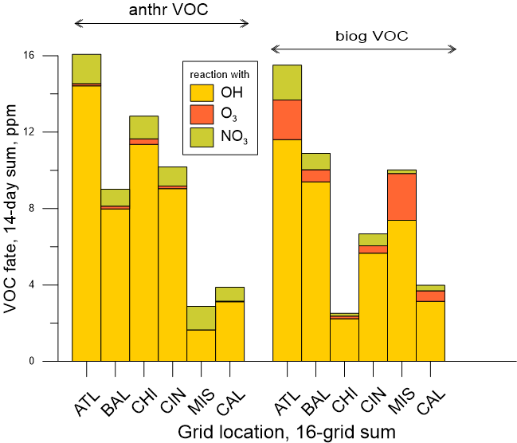

<!-- BEGIN COMMENT -->

[<< 前一章](CMAQ_UG_ch08_analysis_tools.md) - [返回](README.md) - [下一章 >>](CMAQ_UG_ch10_HDDM-3D.md)

<!-- END COMMENT -->

# 9 过程分析

## 9.1 简介
CMAQ的大多数应用，以及其他的3D网格模型，在选定的时间步长内输出感兴趣的化学物种的浓度场，这些浓度场反映了在该时间段内所有对该化学物种起作用的过程（排放、化学反应、传输等）的总影响。尽管输出的浓度场结果本身是有用的，但仅了解所有过程的最终结果会限制对*为什么*浓度场是这种结果的理解。对于某些应用情景，用户可能希望进一步了解影响结果并检查各个过程的定量影响，以识别最重要的或不确定的过程。而过程分析（Process Analysis，PA）就是一种用于分离和量化各个物理和化学过程对预测污染物浓度变化的贡献的技术。PA并不一定要在CMAQ模拟时激活，但是在运行时将PA包含在模拟中可以提供其他信息，这些信息可用于解释CMAQ的计算结果。PA具有两个组件：集成过程速率（Integrated Process Rate，IPR）分析和集成反应速率（Integrated Reaction Rate，IRR）分析。集成过程速率（IPR）分析通过对流、扩散、排放、干沉降、气溶胶过程和云过程等物理过程以及化学过程的整体影响来量化物种的净变化。集成反应速率（IRR）分析允许输出单独的化学反应速率或用户指定的化学反应和物种循环的组合。

作为确定单个化学过程和物理过程相对重要性的工具，PA具有许多应用程序，包括：

- 量化网格单元中化学物质浓度的主要贡献者。PA可用于拆分控制物种浓度的多个复杂过程的贡献。PA对同时发生生成和衰变过程的物种很有用，包括最终浓度变化不大但个体衰变和生成率可能很大的情况。

- 表征特定网格单元的化学状态。具有集成反应速率（IRR）的PA可用于计算数量，例如奇数氧的产生、新自由基的产生、臭氧的产生效率和自由基的终止。（示例请参见Tonnesen和Dennis，2000年。）

- 帮助模型开发。PA可以帮助预测和评估对模型或过程模块进行修改的效果。

- 识别模型或输入数据中的补偿或未解决的错误，这些错误可能未反映在总浓度变化中。例如，如果排放输入数据中的错误导致模型在中间步骤中计算负浓度值，那么如果用化学计算得出的较大正值补偿了该误差，则可以将其掩盖在最终预测浓度中。

通过保存与每个过程或反应相关的微分算子来计算PA变量，并在模型同步时间步长上积分用于求解模型内连续性方程的相同变量。对于在同一操作中同时解决的过程，PA使用质量平衡来计算每个过程的贡献。

用户在CMAQ运行时激活PA，并包括一个PA输入文件，以指定是执行IPR分析、或IRR分析、还是两个分析同时执行，并定义每个分析所需的变量。IRR参数是高度可定制的，可以轻松修改，但是在运行模型之前必须仔细检查以确保它们与所使用的化学机制相对应。在CMAQ v5.2和更早版本中，仅当使用Rosenbrock（ros3）或稀疏矩阵矢量化齿轮（Sparse-Matrix-Vectorized Gear，smvgear）求解器编译CMAQ时，才能运行IRR。但是，在CMAQv5.3中，对代码进行了更新，以允许将IRR与ebi求解器一起使用，并实现增强的气溶胶过程输出。Gipson等人（1999年）详细介绍了PA的由来和用于CMAQ的输入文件格式，Tonnesen（1994年）以及Jeffries和Tonnesen（1994年）详细介绍了PA背后的科学原理。

## 9.2 过程分析的使用

**步骤1：激活过程分析并指定控制文件**

- setenv CTM_PROCAN Y:N

将此变量设置为Y表示要激活过程分析。默认值为N。如果将其设置为Y，则还必须指定以下两个文件：

 - setenv PACM_INFILE [filename]
 - setenv PACM_REPORT [filename]

PACM_INFILE是指定输出信息所需的输入文件（由pa_read.F读取）。Gipson等人（1999年）详细描述了可以使用的方程式和运算符的类型，表1对此进行了简要总结。PACM_REPORT是输出文件，显示了CMAQ如何转换PACM_INFILE中列出的变量，并列出了反应（包括反应物、产物和产率）将用于计算IPR和IRR值。用户应在新的PA模拟的第一次迭代中检查此文件，以确保CMAQ按照用户的意图解释变量。

用户还可以为IPR/IRR输出指定可选的子区域。如果未指定这些变量，则默认区域是整个CMAQ模拟区域，但是，由于文件可能变大，用户可能希望限制写入在输出文件的部分区域。使用以下变量完成此操作：

-   setenv PA_BCOL_ECOL "[start] [end]"
-   setenv PA_BROW_EROW "[start] [end]"
-   setenv PA_BLEV_ELEV "[start] [end]"

其中整数[start]和[end]是开始和结束的网格列、行或垂直层数。这些可选变量用于为过程分析计算指定建模区域网格的列、行和垂直层数范围。用户必须注意列、行和层数不能在当前CMAQ模拟区域之外。

**步骤2：确保模型运行可以输出文件，并且已正确指定输出变量**

在模拟的每一天，都会输出具有步骤1中指定名称的PACM_REPORT文件以及每日IRR或IPR文件，具体取决于是否指定了IRR或IPR。如果PACM_INPUT文件中存在格式错误，则CMAQ将不会运行，并且必须检查CMAQ日志文件以确定发生错误的位置。PACM_REPORT文件将列出用于解释用户在PACM_INPUT文件中指定的每个反应/族/循环/操作员的反应。对于复杂的操作（例如包括族或循环的操作），用户必须确保输出传达适当的数量。

通过以下方式在CMAQ运行脚本中指定输出文件：

- setenv CTM_IPR_1 [filename] (....CTM_IPR_2和CTM_IPR_3与之类似)

- setenv CTM_IRR_1 [filename] (....CTM_IRR_2和CTM_IRR_3与之类似)

仅当在PACM_INFILE中打开IPR时（指定了IPR_OUTPUT），才会创建IPR文件；同样，仅当指定了IRR（IRRTYPE=PARTIAL或FULL）时，才会创建IRR文件。创建的输出文件的数量（是1、2还是3）取决于指定的变量数量。例如，对于作为CMAQ发布版本的一部分提供的输入文件示例，将只创建一个输出文件。

**步骤3：处理过程分析的输出文件**

PA的输出文件与浓度文件的单位相同，可以使用与CMAQ浓度文件后处理相同的实用程序进行后处理。特别是以下实用程序可能会有所帮助：

- combine（在一个文件中合并多天，以使密度或层高与IPR或IRR变量匹配）
- m3tproc（合计多天的生成量）
- vertot（合计多个层的生成量，例如PBL）
- verdi（用于查看过程生成量中的空间异质性）

## 9.3 PACM_INFILE文件说明

PA的输入文件（PACM_INFILE）是用户定制的文件，用于控制在每个时间步长计算和输出的参数。根据输出的要求，文件将需要针对模拟中使用的化学机制进行定制，因为物种名称和反应数在不同机制中会有所不同。例如，氮氧化物的成分，如有机硝酸盐，在CB6中表示为NTR1 + NTR2 + INTR，而在SAPRC07中表示为RNO3。另外，如果IRR输出由标签指定，则用户必须确保标签适合所使用的化学机制。

用户可以定义类似污染物的族（family）、指定循环和反应合计，以在后续IPR和IRR方程中使用，从而简化数量说明。当用户想要跟踪几种不同种类的总和时，DEFINE FAMILY（族定义）非常有用，例如：

- DEFINE FAMILY NOX = NO + NO2

这将允许用户使用定义的族“NOX”来指定NO和NO2的操作。循环很重要，因为许多物种的反应都会使它们迅速衰减并重新形成。在某些情况下，生产和损失期可能都很大，并且掩盖了用户所需的信息。

- DEFINE FAMILY PANcyc = PAN

在以后的操作中，可以使用用户定义的名称PANcyc代替PAN，以消除PAN的快速循环反应的影响。周期（以及其他数量）也可以用RXNSUM语句定义：

- DEFINE RXNSUM CLNO3cyc      = <CL28\> - <CL30\>

这将在标有CLNO3cyc的用户指定变量中存储标记为CL28的反应的净通量减去标记为CL30的反应的净通量（即在CMAQ-CB6中，物种CLNO3的净产量）。

**表9-1. PACM_INFILE中使用的参数**

|**First string**| **Second string** |**Third string**|**Remainder of line**|
|:-------------|:----------------------------|:-----|:-----------------------------|
|DEFINE FAMILY|[descriptor]|=|化学物质清单（list of chemicals），用“+"分隔|
|DEFINE CYCLE|[descriptor]|=|化学物质名称（chemical name）|
|DEFINE RXNSUM|[descriptor]|=|反应清单（list of reactions），用“+"分隔|
|IPR_OUTPUT|[chemical/family name]| = |物理过程和/或化学过程名称（physical process names and/or CHEM）|
|IRR_OUTPUT|  FULL:PARTIAL:NONE     |
|IRR_OUTPUT|[descriptor]| = |反应标签、物种反应组合等（reaction label, combination of species reactions, etc）|

## 9.4 IPR参数

IPR_OUTPUT的每一行均以IPR_OUTPUT开头，后面是需要输出的化学物种或者物种族（family），再后面是输出的过程。如果省略了过程，则默认为所有过程。表9-2中列出了可用的过程。在示例文件中，例如：

IPR_OUTPUT O3    =  CHEM+DDEP+CLDS+AERO+TRNM;

上面的“CHEM+DDEP+CLDS+AERO+TRNM”就是指定的输出的过程，包括随时间步长变化的物种O3所有化学过程的净合计、净干沉降、由于云、气溶胶引起的浓度净变化过程、和总传输。如果物种是族名称而不是物种名称，则输出将针对该族中每个物种的总和进行计算。

**表9-2. 过程输出的允许参数**

|**LPROC**|**过程**| **描述**|
|:-------|:-----|:---------|
|1|ZADV| 垂直对流，vertical advection|
|2|HADV| 水平对流，horizontal advection|
|3|HDIF| 水平扩散，horizontal diffusion|
|4|VDIF| 垂直扩散，vertical diffusion|
|5|EMIS| 排放对浓度的贡献，emissions contribution to concentration|
|6|DDEP| 物种的干沉降，dry deposition of species|
|7|CLDS| 云过程造成的变化，包括液相反应以及被云和雨水去除；change due to cloud processes; includes aqueous reaction and removal by clouds and rain|
|8|CHEM| 在输出步骤中物种的所有化学过程的总和，net sum of all chemical processes for species over output step|
|9|COND| 冷凝导致的气溶胶物种变化，change in aerosol species due to condensation|
|10|COAG| 凝结导致的气溶胶物种变化，change in aerosol species due to coagulation|
|11|NPF| 由于形成新的颗粒而导致的气溶胶物种变化，change in aerosol species due to new particle formation|
|12|GROW| 气溶胶生长导致的气溶胶物种变化，change in aerosol species due to aerosol growth|
|9+10+11+12|AERO| 在气溶胶过程发生的全部变化，change due to aerosol processes|
|1+2|MADV| 水平和垂直对流，Horizontal and vertical advection|
|3+4|TDIF| 水平和垂直扩散，Total diffusion of species|
|1+2+3+4| TRNM|物种的总质量平衡传输过程，Total mass-conserving transport of species|

## 9.5 IRR的参数

IRR输出中的参数说明以IRR_OUTPUT开头，后面是用户定义的数量名称，再后面是如何计算该数量的公式。Gipson等人（1999年）更详细地解释了用于构造这些方程式的运算符。表9-3列出了允许的运算符的简要摘要。该方程式可以包括化学物种或族的反应标签或运算符。例如：

IRR_OUTPUT NewClrad = 2.0*<CL1\> + <CL2\> + <CL8\> + <CL25\>

将标记为CL2、CL8和CL25的反应的通量，以及标记为CL1的反应的通量的2倍相加。每个时间步长和每个网格的总和将在用户定义的变量NewCLrad中。

**表9-3. 允许的综合反应速率（IRR）输出运算符**

|**运算符**          | **描述**|
|:------|:----|
|PROD[x] {FROM [y] {AND/OR [z]}} | 物种（或族）x是所有反应的通量总和。对于种类y或z是反应物时，可选的限定词限制为反应|
|NETP[x] {FROM [y] {AND/OR [z]}} | 类似于PROD，但仅使用净产量大于零的反应|
|LOSS[x]  {AND/OR[y]}| 物种/族x的所有损失；可能仅限于同时丢失x和y或x或y的反应|
|NETL[x] {AND/OR [y]} | 类似于LOSS，但仅使用x {和/或y}的净损失大于零的反应|
|NET[x]| x是产物或反应物的所有反应的产量和损失净额|
|cyclename[POSONLY:NEGONLY]| 计算先前定义的周期的净影响。仅当净影响为正数或负数时，使用可选的限定词才会输出值|

## 9.6 IRR应用示例

可以无限地定制IRR，以检查许多不同的过程以及过程的组合。下面是两个有关如何使用IRR的示例。

**示例1：检查VOC反应的结局**
在此示例中，我们将一个族"aVOC"定义为CMAQ-CB6中使用的所有（大部分）人为VOCs的总和（Luecken等，2019），然后通过与氧化剂OH，O3和NO3反应来量化该族的损失：

- DEFINE FAMILY aVOC = FORM +ALD2 +ALDX +PAR +ETHA +PRPA +MEOH +ETOH +ETH +OLE +IOLE +ACET +TOL +XYLMN +GLYD +GLY +MGLY +KET +CRON +NTR1 +OPEN +CAT1 +CRES +XOPN +NAPH + TO2 + BZO2 + XLO2 + ROR + XPRP + ROOH;
- IRR_OUTPUT aVOCwithOH = LOSS[aVOC] AND [OH];
- IRR_OUTPUT aVOCwithO3 = LOSS[aVOC] AND [O3];
- IRR_OUTPUT aVOCwithNO3 = LOSS[aVOC] AND [NO3];

我们将模型的第一层中2周（2011年7月1日至14日）的产生量进行了合计，并比较了美国境内四个位置的这三个输出路径。图9-1显示了6个不同的网格区域内每个过程的总和，包括4个城市区域和2个农村区域。该图件还包括了大部分生物源VOCs的相应结局，但请注意，某些VOCs（例如甲醛和乙醇）可能是人为源和生物源共同作用的。

**图9-1. 使用过程分析（PA）对VOCs氧化途径的相对贡献分析结果**

**示例2：量化HNO3生成的主要贡献者** 
在此示例中，我们开发输出变量以表示CMAQ-CB6中HNO3的总产量以及对该总产量有贡献的各个反应：

- IRR_OUTPUT HNO3prod = PROD[HNO3];
- IRR_OUTPUT HNO3fromOHNO2 = <R45\>;
- IRR_OUTPUT HNO3fromhetNTR = <HET_NTR2>;
- IRR_OUTPUT HNO3fromN2O5 = <HET_N2O5IJ> +<HET_N2O5K> +<HET_H2NO3PIJA>+<HET_H2NO3PKA>;
- IRR_OUTPUT HNO3fromNO3 = PROD[HNO3] FROM [NO3];
- IRR_OUTPUT HNO3frCLNO3= <HET_CLNO3_WAJ>;

在此示例中，我们将和前述相同的14天时间段内模型的前15层（近似于PBL）的所有产生量进行了合计。图9-2显示了过程对三个网格处总HNO3形成的相对贡献。在此示例中，在两个城市网格上，OH+NO2的反应主导了夏季HNO3的形成，而在农村网格单元（密苏里州），硝酸烷基酯的异质水解占主导地位。

**图9-2. 三个网格位置上HNO3形成途径的相对贡献**

## 9.7 参考文献

Gipson, G.L. (1999). Chapter 16: Process analysis. In science algorithms of the EPA models-3 Community Multiscale Air Quality (CMAQ) Modeling System. EPA/600/R-99/030.

Jeffries, H. E., & Tonnesen, S. (1994). A comparison of two photochemical reaction mechanisms using mass balance and process analysis. Atmos. Env., 28(18), 2991-3003.

Luecken, D.J., Yarwood, G., & Hutzell, W.H. (2019). Multipollutant modeling of ozone, reactive nitrogen and HAPs across the continental US with CMAQ-CB6. Atmospheric Environment, 201, 62-72.

Tonnesen, S., & Jeffries, H.E. (1994). Inhibition of odd oxygen production in the carbon bond four and generic reaction set mechanisms. Atmospheric Environment, 28(7), 1339-1349.

<!-- BEGIN COMMENT -->

[<< 前一章](CMAQ_UG_ch08_analysis_tools.md) - [返回](README.md) - [下一章 >>](CMAQ_UG_ch10_HDDM-3D.md) 
CMAQ用户指南 (c) 2020 

<!-- END COMMENT -->
