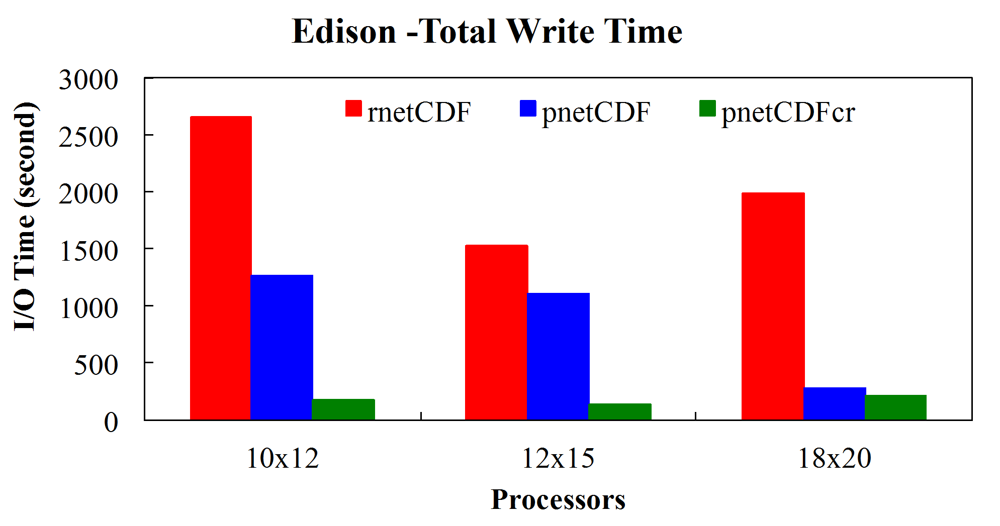
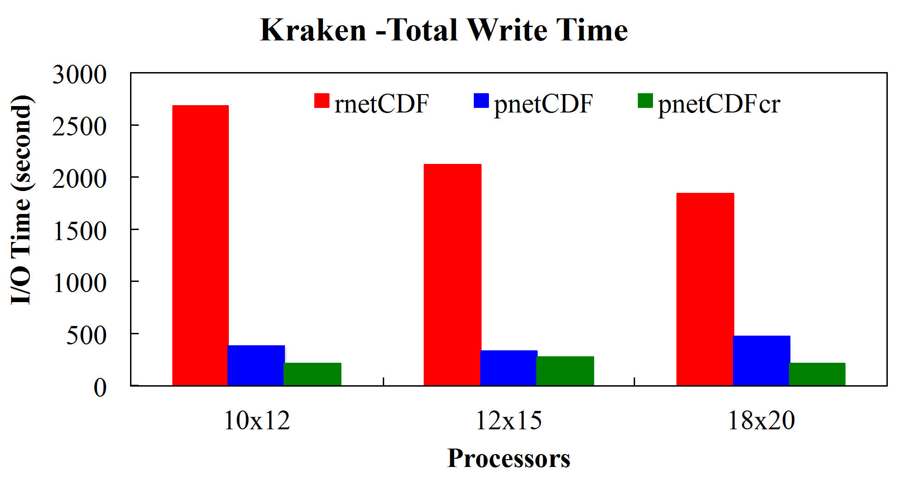
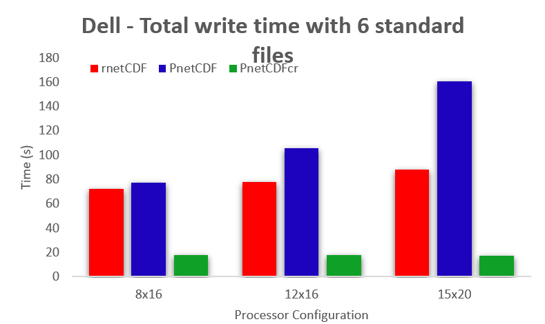
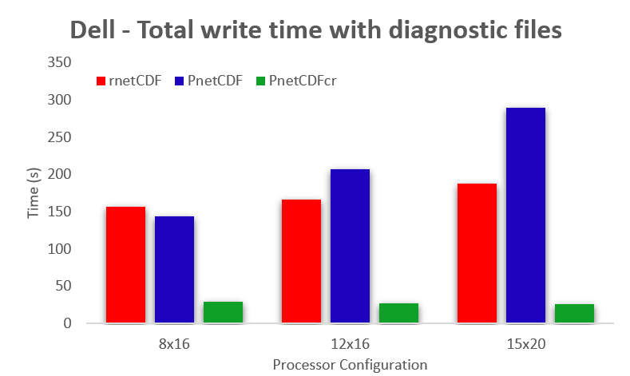

## CMAQ教程
### 改善CMAQ模型运行的方法
目的：本教程提供了CMAQ开发人员推荐的常见选项和方法，以改善常见系统上的模型运行效率。


------------
#### 1. Linux环境设置

```
limit stacksize unlimited 
```

#### 2. HPC队列管理器选项

一个考虑因素是保留运行CMAQ的整个节点，以便模拟可以利用最大的资源。 在SLURM队列管理器中，可以使用以下选项。
```
#SBATCH --exclusive
```

#### 3. 运行时处理器配置设置

当作业在分布式系统上运行时，您需要为这对变量提供值：

```
@ NPCOL  = m; @ NPROW =  n
```

其中m应该<=n，并且m和n应该尽可能接近SQRT(m*n)。


#### 4. CMAQ中的真正并行IO操作

CMAQ模型可以启用并行I/O（PIO）功能，称为“mpi” I/O API库（Wong等人，2015）。有关如何在CMAQ中启用PIO的更多信息，请参见[附录D]( ../Appendix/CMAQ_UG_appendixD_parallel_implementation.md )。
 
要使用此选项，请检查以下清单：

* 已安装PnetCDF，底层计算系统应具有并行文件系统，例如Lustre或者Beefs
* 编译CMAQ时，在bldit_cctm.csh中取消注释“set build_parallel_io”行
* 已安装适当版本的IOAPI 3.2（请联系wong.david-c@epa.gov的David Wong获取更多信息）
* 在运行脚本中的所有输出文件中插入“MPI：”前缀，例如：setenv S_CGRID "MPI: $OUTDIR/CCTM_CGRID_${CTM_APPL}.nc"

这是具有不同并行文件系统的各种系统上CMAQ并行IO性能的一些示例。在每个图中，rnetCDF表示当前CMAQ使用的I/O方法，PnetCDF表示直接PnetCDF并行I/O方案的应用，PnetCDFcr表示我们基于PnetCDF开发的新方案（请参见下文）

* 使用Luster并行文件系统（Edison和Kraken几年前跻身全球最快的超级计算机之列）：





* 使用可免费获得的BeeGFS并行文件系统：





Wong, D.C., Yang, C.E., Fu, J.S., Wong, K., & Gao, Y. (2015). An approach to enhance pnetCDF performance in environmental modeling applications. Geosci. Model Dev., 8, 1033-1046.